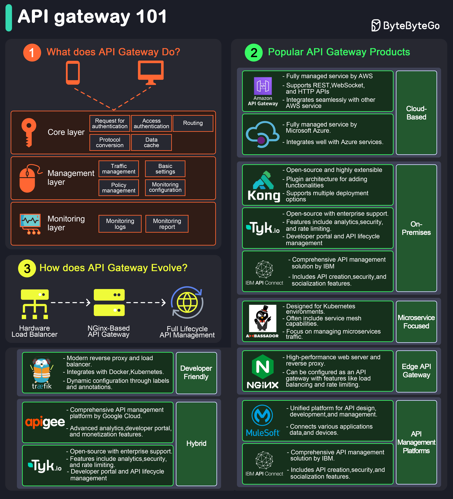

# ✅ **API Gateway**



# **1. What Does an API Gateway Do?**

An **API Gateway** is a server that acts as the **entry point** for all client requests.
It sits between the client and backend services and handles:

### **Core Layer Responsibilities**

| Function                              | Explanation                                                                      |
| ------------------------------------- | -------------------------------------------------------------------------------- |
| **Authentication (Request & Access)** | Validates identity (tokens, API keys, OAuth). Controls access to protected APIs. |
| **Routing**                           | Routes incoming requests to correct backend microservice.                        |
| **Protocol Conversion**               | Converts protocols like HTTP ↔ gRPC ↔ WebSocket.                                 |
| **Data Caching**                      | Caches frequent API responses to speed up retrieval.                             |

### **Management Layer**

| Function                     | Explanation                                             |
| ---------------------------- | ------------------------------------------------------- |
| **Traffic Management**       | Controls flow of requests, avoids system overload.      |
| **Policy Management**        | Global rules: CORS, timeouts, retries, transformations. |
| **Monitoring Configuration** | Set what metrics/logs need to be collected.             |

### **Monitoring Layer**

| Function               | Explanation                                      |
| ---------------------- | ------------------------------------------------ |
| **Monitoring Logs**    | Detailed request/response logs.                  |
| **Monitoring Reports** | Traffic graphs, latency reports, error heatmaps. |

## **Key Functions**

### **1. Request Routing**

Maps URL → backend service (example: /users → user-service).

### **2. Load Balancing**

Distributes traffic across multiple service instances.

### **3. Security**

- Authentication (JWT, OAuth2)
- Authorization (RBAC)
- Encryption (TLS)
- IP whitelisting, WAF

### **4. Rate Limiting & Throttling**

Prevents abuse:
e.g., **200 requests/min per client**.

### **5. API Composition**

Gateway merges multiple API calls → 1 response.
Useful in microservices.

### **6. Response Caching**

Improves speed & reduces load.

---

# **2. Popular API Gateway Products**

### **Cloud-Based**

| Product                  | Highlights                                                                     |
| ------------------------ | ------------------------------------------------------------------------------ |
| **AWS API Gateway**      | Fully managed, supports REST/WebSocket, integrates tightly with AWS ecosystem. |
| **Azure API Management** | Managed service with strong Azure integration.                                 |

### **On-Premises / Self-Hosted**

| Product             | Highlights                                                          |
| ------------------- | ------------------------------------------------------------------- |
| **Kong**            | Open-source, plugin architecture, scalable for high traffic.        |
| **Tyk.io**          | Open-source but enterprise-supported; analytics + gateway + portal. |
| **IBM API Connect** | Enterprise-heavy API management + security.                         |

### **Microservice-Focused**

| Product        | Highlights                                                    |
| -------------- | ------------------------------------------------------------- |
| **Ambassador** | Designed for Kubernetes.                                      |
| **NGINX**      | Reverse proxy + API gateway capabilities (rate limiting, LB). |

### **Developer-Friendly**

| Product     | Highlights                                      |
| ----------- | ----------------------------------------------- |
| **Traefik** | Automatic service discovery, Kubernetes-native. |

### **Hybrid Platforms**

| Product             | Highlights                                                      |
| ------------------- | --------------------------------------------------------------- |
| **Apigee** (Google) | Full API management: analytics, monetization, developer portal. |
| **MuleSoft**        | Connects apps/data/devices, large enterprise integrations.      |

---

## **3. API Gateway Evolution**

### **Stage 1 – Hardware Load Balancer**

- F5, Netscaler.
- Only load balancing + some routing.

### **Stage 2 – NGINX-based API Gateway**

- Reverse proxy + rate limiting + routing.
- Lightweight, widely used.

### **Stage 3 – Full Lifecycle API Management**

- Developer portals
- Authentication policies
- Analytics
- Monetization
- Versioning
- Traffic governance

Examples: Apigee, Kong Enterprise, IBM API Connect.

---

## ✅ **INTERVIEW CROSS QUESTIONS + BEST POSSIBLE ANSWERS**

### **Q1. Why do microservices NEED an API gateway?**

**Answer:**
Without a gateway, the client must know each service’s IP, handle auth for each service, manage retries, timeouts, and versioning.
The gateway:

- centralizes auth
- hides internal topology
- provides rate limiting
- aggregates responses

### **Q2. API Gateway vs Load Balancer – Difference?**

**Answer (sharp):**
A **load balancer** distributes traffic.
An **API gateway** manages the _entire API lifecycle_, including:

- auth
- rate limiting
- caching
- routing
- protocol conversion
- transformations

Load balancer is L4/L7 networking.
API gateway is an API management layer.

### **Q3. How does API Gateway handle failures?**

**Answer:**

- Circuit breakers (stop calling failing services)
- Retries with exponential backoff
- Timeout enforcement
- Fall back responses
- Canary routing for partial deployment

### **Q4. What are common patterns in an API gateway?**

**Answer:**

- **Fan-out pattern** → one request → multiple backend calls
- **Protocol translation** → HTTP ↔ gRPC
- **Request/response transformation** (remove/add headers, rewrite URLs)
- **JWT validation**
- **Rate limiting**: Token bucket, Leaky bucket

### **Q5. Isn’t API Gateway a single point of failure?**

**Answer:**
No. Production gateways use:

- multiple instances
- autoscaling
- global Anycast routing
- multi-region setup
- active-active redundancy

### **Q6. What are drawbacks of API gateways?**

**Answer:**

- Extra latency
- Single control plane → must scale correctly
- Complex configuration
- Dependency risk (gateway outage affects all services)

### **Q7. Gateway vs Service Mesh?**

**Answer:**

| **API Gateway**                | **Service Mesh**                                    |
| ------------------------------ | --------------------------------------------------- |
| Manages north–south traffic    | Manages east–west traffic between services          |
| Handles routing, auth, caching | Handles service-to-service mTLS, retries, telemetry |
| Client → Gateway → Services    | Service → Sidecar → Service                         |

Service mesh examples: Istio, Linkerd.

### **Q8. If you were building a large-scale system, which gateway would you choose?**

**Sample Answer:**

- On AWS → AWS API Gateway + ALB
- Kubernetes → Ambassador or Kong
- Hybrid enterprise → Apigee or Tyk
- On-prem with high performance → NGINX or Kong OSS

### **Q9. Explain Rate Limiting Techniques**

**Answer:**

- **Token Bucket** → Flexible, allows bursts
- **Leaky Bucket** → Fixed rate output
- **Fixed window** → Simple but unequal distribution
- **Sliding window log/counter** → Most accurate

### **Q10. How does caching work in an API Gateway?**

**Answer:**
The gateway caches:

- successful GET responses
- with TTL
- based on request signature (URL + query + headers)

Benefits:

- improves performance
- reduces database load

---

# ✅ **Proxy vs Reverse Proxy — Interview Notes**

## **1. What is a Proxy?**

A **forward proxy** sits between a **client and the internet**.

### **Purpose**

- Hides the client’s identity (IP masking)
- Controls outbound traffic
- Used for security, anonymity, and content filtering

### **How it Works**

Client → Proxy → Internet (server)

### **Use Cases**

- Corporate office internet filtering
- User anonymity (VPNs, Tor)
- Logging and auditing requests

## **2. What is a Reverse Proxy?**

A **reverse proxy** sits between the **internet and the servers**.

### **Purpose**

- Hides internal servers
- Provides load balancing
- Adds caching, compression, SSL termination
- Protects backend from DDoS or malicious clients

### **How it Works**

Client → Reverse Proxy → Backend Server(s)

### **Use Cases**

- NGINX / Apache reverse proxy
- CDN edge servers
- Hiding microservice topology

## **3. Proxy vs Reverse Proxy — Side-by-Side**

| Feature       | Proxy (Forward Proxy)                   | Reverse Proxy                            |
| ------------- | --------------------------------------- | ---------------------------------------- |
| Lies between  | Client → Internet                       | Internet → Server                        |
| Protects      | Clients                                 | Servers                                  |
| Used for      | Anonymous browsing, filtering, blocking | Load balancing, caching, SSL termination |
| Clients know? | Yes                                     | No (transparent)                         |
| Servers know? | No                                      | Yes                                      |

# 💬 **Common Interview Question**

### **Q: Which one provides anonymity to the server?**

**A:** Reverse Proxy

### **Q: Which one provides anonymity to the client?**

**A:** Forward Proxy

---

# ✅ **Reverse Proxy vs API Gateway vs Load Balancer**

# **1. Reverse Proxy**

A **reverse proxy** is a server that forwards requests to one or more backend servers.

### **Key Functions**

- Basic routing
- SSL termination
- Caching
- Compression
- Security (hide backend servers)

### **Examples**

NGINX, Apache, HAProxy (in reverse mode), Cloudflare (partial)

# **2. Load Balancer**

A load balancer **distributes traffic** across multiple backend servers.

### **Key Functions**

- Traffic distribution (Round Robin, IP hash, Least Connections)
- Health checks
- Failover
- High availability

### **Types**

- **Layer 4 LB** (TCP/UDP level)
- **Layer 7 LB** (HTTP routing, cookie-based routing)

### **Examples**

AWS ALB/ELB, GCP Load Balancer, HAProxy

# **3. API Gateway**

API Gateway is a **reverse proxy with superpowers**, specific to APIs.

### **Key Functions**

- Authentication (JWT/OAuth)
- Rate limiting / Quotas
- Protocol conversion (HTTP ↔ gRPC)
- Request/response transformation
- API composition
- Monitoring & analytics
- Version management

### **Examples**

Kong, Tyk, Apigee, AWS API Gateway

# 🆚 **Reverse Proxy vs Load Balancer vs API Gateway—Comparative Table**

| Feature                    | Reverse Proxy           | Load Balancer      | API Gateway              |
| -------------------------- | ----------------------- | ------------------ | ------------------------ |
| Primary purpose            | Protect backend + route | Distribute traffic | Manage API traffic       |
| Handles auth?              | ❌ No                   | ❌ No              | ✅ Yes                   |
| Rate limiting              | ❌ No                   | ❌ No              | ✅ Yes                   |
| API transformation         | ❌ No                   | ❌ No              | ✅ Yes                   |
| Caching                    | ✅ Yes                  | ⚠️ Some have       | ⚠️ Optional              |
| SSL termination            | ✅ Yes                  | ⚠️ Yes (L7 LB)     | ❌ Usually handled by LB |
| Microservice fan-out       | ❌ No                   | ❌ No              | ✅ Yes                   |
| Suitable for               | Web servers             | Scaling backend    | Microservices & APIs     |
| Exposes backend?           | No                      | No                 | No                       |
| Talk to multiple services? | ⚠️ Usually 1            | ⚠️ No              | ✅ Yes                   |

# 🎯 **Simple Diagram to Remember**

```
Client
  |
  | -> (Forward Proxy) -> Internet
  |
Internet -> (Reverse Proxy) -> Servers
               |
               -> (Load Balancer) -> Server Pool
               |
               -> (API Gateway) -> Microservices
```

---

# 🔥 **Interview Cross Questions + Answers**

## **Q1. How is an API Gateway different from a Reverse Proxy?**

**Answer:**

A reverse proxy forwards requests to backend servers.
An API Gateway **adds API-specific features**:

- Auth
- Rate limiting
- API keys
- Analytics
- Protocol translation
- Error handling

Reverse proxy = traffic router
API Gateway = traffic router + API manager

---

## **Q2. Can a load balancer act as a reverse proxy?**

**Answer:**
Yes.
All modern Layer-7 load balancers are reverse proxies, but not all reverse proxies do load balancing.

---

## **Q3. Can you replace API Gateway with NGINX?**

**Answer:**
NGINX can:

- route
- cache
- load balance

But it **cannot** natively:

- validate OAuth/JWT
- perform rate limiting at API-level
- handle API versioning
- provide analytics
- do request/response transformation

You _can_ build these using NGINX + Lua scripts, but API Gateways do it out-of-the-box.

---

## **Q4. In a microservice system, where do you use each?**

**Answer:**

| Layer                          | Component                    |
| ------------------------------ | ---------------------------- |
| Edge                           | CDN / Reverse Proxy          |
| Traffic Distribution           | Load Balancer                |
| API Management                 | API Gateway                  |
| Internal Service Communication | Service Mesh (Istio/Linkerd) |

---

## **Q5. What happens if an API Gateway goes down?**

**Answer:**
It is a critical single point of failure — so companies deploy:

- multiple instances
- autoscaling
- multi-AZ multi-region
- active-active failover

---

## **Q6. Can API Gateway replace a Load Balancer?**

**Answer:**
No.
API Gateways handle **L7 API policies**, not:

- TCP-level load balancing
- SSL termination at global scale
- millions of RPS distribution

Often architecture is:

**Client → Load Balancer → API Gateway → Microservices**

---
