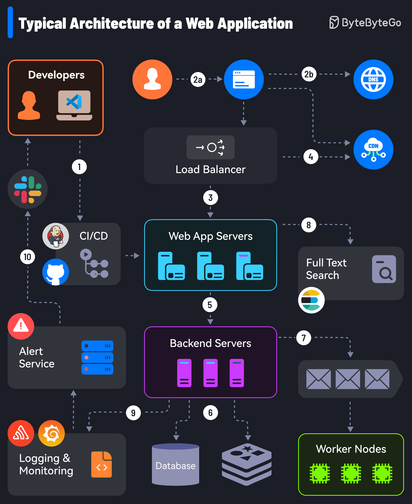
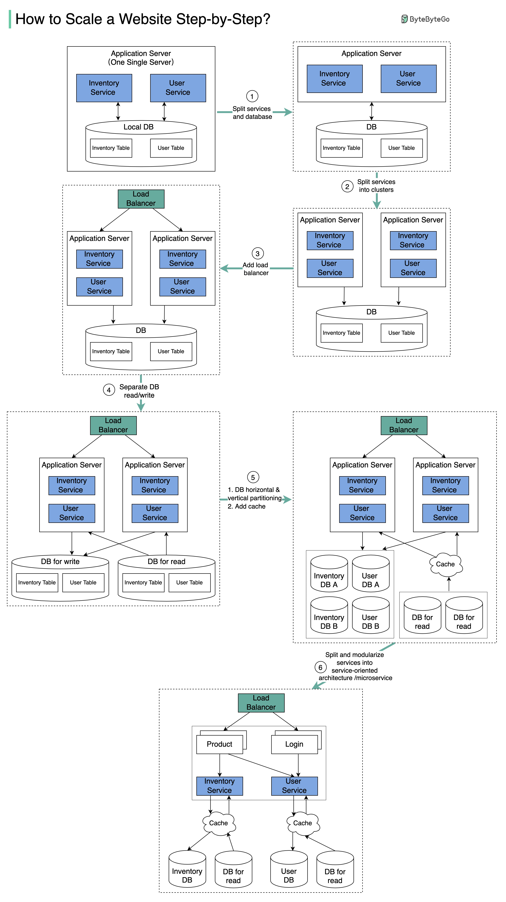

# Typical Web Application Architecture


This diagram shows a canonical, production-grade web application architecture with two main flows:

1. **User request path (runtime traffic):** DNS → CDN (optional) → Load Balancer → Web App Servers → Backend Servers → Datastore / Cache / Search / Worker nodes → Responses.
2. **Developer & CI/CD path (devops & deployment):** Developers push code → CI/CD → deploy to Web App / Backend; alerts, logging, and monitoring integrate across the system.

- It all starts with CI/CD pipelines that deploy code to the server instances. Tools like Jenkins and GitHub help over here.
- The user requests originate from the web browser. After DNS resolution, the requests reach the app servers.
- Load balancers and reverse proxies (such as Nginx & HAProxy) distribute user requests evenly across the web application servers.
- The requests can also be served by a Content Delivery Network (CDN).
- The web app communicates with backend services via APIs.
- The backend services interact with database servers or distributed caches to provide the data.
- Resource-intensive and long-running tasks are sent to job workers using a job queue.
- The full-text search service supports the search functionality. Tools like Elasticsearch and Apache Solr can help here.
- Monitoring tools (such as Sentry, Grafana, and Prometheus) store logs and help analyze data to ensure everything works fine.
- In case of issues, alerting services notify developers through platforms like Slack for quick resolution.

### Developers

- Role: Authors of code (frontend, backend, infra-as-code). They push to version control, create PRs, run local builds/tests.
- Typical tools: Git + GitHub/GitLab, Editor/IDE (VS Code is pictured), Slack for collaboration, ticketing (Jira).
- Responsibilities: write unit/integration tests, format/lint code, create deployment manifests, verify security scans, update CI pipeline config.

### 1 — CI/CD (continuous integration / continuous delivery)

- **What it does:** Runs builds, tests (unit, integration, end-to-end), security scans (SAST), linters, artifact creation, and deployment steps (can be pipelines for staging and production). Often integrates with version control (webhooks).
- **Deployment strategies supported:** Blue/Green deploys, Canary releases, Rolling updates, A/B deployments.
- **Key steps in pipeline:**

  - Run automated tests → Build artifacts (container images) → Push artifacts to registry → Deploy to staging → Run smoke tests → Promote to production.

- **Security & compliance:** Secrets management (Vault/Secrets Manager), code-signing, dependency scanning.
- **Common tools:** Jenkins (icon present), GitHub Actions, GitLab CI, CircleCI, ArgoCD/Flux for GitOps.

### 2a — Client request / browser

- The client initiates requests (HTTP/HTTPS) to the application. This is the user's browser or mobile app.

### 2b — DNS (Domain Name System)

- **Responsibility:** Maps user-friendly domain names to IP addresses of load balancers or CDN edge nodes.
- **Considerations:** Use low TTLs for fast failovers; DNS-based load balancing (round-robin, geoDNS); DNS resolvers and caching behavior; DNS security (DNSSEC).
- **Edge cases:** DNS propagation delays during IP changes.

### 4 — CDN (Content Delivery Network)

- **Purpose:** Cache and deliver static assets (images, JS/CSS), edge-rendered content, and sometimes dynamic content (via edge functions). Reduces latency and origin load.
- **Benefits:** Lower latency for global users, reduced bandwidth costs, DDoS protection (some CDNs provide WAF), TLS offloading.
- **Cache-control strategies:**

  - Strong caching for immutable assets (fingerprinted filenames).
  - Shorter TTLs or `stale-while-revalidate` for near-static assets.
  - Use `Cache-Control`, `ETag`, `Last-Modified`.

- **Edge compute:** Lambda@Edge / Cloudflare Workers can perform logic at CDN.
- **When to bypass CDN:** Authenticated dynamic content, user-specific data (unless caching by Vary header or personalization tokens).

### Load Balancer

- **Role:** Distribute incoming HTTP(S) traffic across multiple web app servers. Perform health checks, TLS termination (optional), and forward headers.
- **Types:** L4 (TCP) vs L7 (HTTP) load balancers. L7 understands HTTP semantics and can do sticky sessions, path-based routing, and host-based routing.
- **Features:**

  - Health checks and circuit breaker style routing (stop sending traffic to unhealthy instances).
  - Session affinity ("sticky sessions") if session is in-memory (not recommended at scale).
  - Rate limiting, request filtering, TLS termination, and sometimes WAF features.

- **Scaling:** Use autoscaling groups behind LB; horizontal scaling for web/app tier.
- **Failure handling:** Multiple LBs across AZs/regions for high availability.

### 3 — Web App Servers (frontend application servers)

- **Responsibilities:**

  - Serve frontend assets if not served by CDN.
  - Serve server-side rendered pages (SSR) or act as API gateway proxy to backend servers.
  - Handle user sessions (stateless preferred), input validation, authentication checks (cookie/jwt).

- **State management:** Prefer stateless app servers—store session state in external store (Redis, DB) or use JWT cookies.
- **Scaling & resilience:** Horizontal scale; ephemeral instances; health checks; containerized or serverless options.
- **SSL/TLS:** Either at LB or app server if LB is passthrough.
- **Security:** Sanitize inputs, rate-limit per IP or user, protect against common attacks (XSS, CSRF).

### 5 — Backend Servers (business logic / API servers)

- **Role:** Implement core business logic, orchestrate calls to databases, cache, third-party services, search, and worker queues.
- **Design patterns:**

  - Microservices split by bounded contexts (each service owns its data).
  - Monolith-in-the-middle (modular monolith) for smaller teams.

- **Responsibilities:** Authorization, transactions, data validation, resiliency patterns (circuit breakers, bulkheads), logging.
- **APIs:** REST/GraphQL/gRPC endpoints for web and mobile clients.
- **Scaling:** Autoscale based on CPU, latency, or custom metrics (requests/sec).

### 6 — Datastore (Database) & Cache (Redis)

- **Database (Relational/NoSQL):**

  - Stores persistent state: users, transactions, product catalogs, event logs (depending on design).
  - **Relational DBs:** ACID, complex queries, joins (Postgres, MySQL). Use replication (read replicas), partitioning (sharding) for scale.
  - **NoSQL:** For document or key-value patterns (MongoDB, Cassandra) when schema flexibility or massive scale is needed.

- **Cache (Redis / Memcached):**

  - Stores frequently-accessed data to reduce DB load: session objects, computed results, rate limit counters.
  - **Cache patterns:** Cache-aside (application populates cache), write-through, write-behind, read-through.
  - **Invalidation:** Hard problem — ensure TTLs and event-based invalidation (pub/sub) for consistency.
  - **Persistence concerns:** Redis persistence (RDB/AOF) vs purely ephemeral caches.

- **Scaling DBs:**

  - Vertical scale (bigger machines) vs horizontal (sharding).
  - Use read replicas for read-heavy workloads.
  - Use connection pooling and prepared statements.

### 7 — Message queue / Notification / Worker nodes

- **Message queue (depicted near the worker box):**

  - Asynchronous communication between services (eg. RabbitMQ, Kafka, SQS). Used for decoupling, buffering, retry semantics.
  - Guarantees: at-most-once, at-least-once, or exactly-once semantics (exactly-once is complex).

- **Worker nodes (green box):**

  - Consume messages to perform background tasks: sending emails, image processing, resizing, scheduled jobs, long computations, retries.
  - **Idempotency:** Workers should be idempotent (safe to retry).
  - **Scaling:** Scale consumers by queue depth and processing time.
  - **Visibility timeouts & retries:** Ensure dead-letter queues for poisoned messages.

- **Use-cases:** Bulk emails, data crunching, generating thumbnails, sending push notifications, interactions with third-party APIs.

### 8 — Full-text search (Elasticsearch icon)

- **Responsibility:** Provide search indexing and full-text search functionality separate from primary DB.
- **Why external search:** DBs are not optimized for full-text, faceted search, or analytics-driven queries.
- **Indexing patterns:** Near-real-time indexing via change-data-capture (CDC), message queues, or direct pushes from backend.
- **Considerations:** Mapping design, analyzers, tokenization, shard/replica config, cluster scaling, backups, and consistency.
- **Failure modes:** Stale indexes; need re-indexing during schema changes.
- **Security:** Secure cluster access and limit public exposure.

### 9 — Logging & Monitoring → Alert Service

- **Logging & monitoring stack:**

  - Centralized logging (ELK/EFK stack — Elasticsearch/Fluentd/Kibana or Loki + Grafana).
  - Metrics collection (Prometheus, Datadog, CloudWatch) for SLIs and SLOs.
  - Tracing (distributed tracing with Jaeger/Zipkin/OpenTelemetry) for request flows across microservices.
  - Synthetic tests and uptime checks.

- **Alerting:** On-call alerts based on SLO breaches, error rates, latency p50/p95/p99, saturation metrics.
- **On-call & runbooks:** Define escalation, runbooks for common faults, alert thresholds to avoid alert fatigue.
- **Monitoring best-practices:** Instrument key business metrics, create dashboards, add anomaly detection.
- **Cost & retention:** Manage log retention and indexing costs (compress/rollover, cold storage).
- **Security & privacy:** Scrub PII from logs before shipping; control access.

### 10 — Developer communication (Slack) and integration

- CI/CD pipelines often notify developer channels on failures or deployments (Slack, MS Teams).
- Notifications help tie developers to production changes: alerts from monitoring are sent here too.

# Common interview questions

**Q: Why use a CDN? When might you bypass it?**

A: Use CDN to reduce latency, offload static content, and provide DDoS protection. Bypass CDN for highly personalized content or where dynamic content cannot be cached safely. For authenticated endpoints, use `Cache-Control` with appropriate `Vary` headers or edge compute to personalize.

**Q: What is sticky session and why avoid it?**

A: Sticky sessions bind client to a specific instance. Avoid because it reduces flexibility for autoscaling and load distribution; instead store session state externally (Redis) or use JWT tokens.

**Q: How do you scale a database?**

A: Read replicas for read scaling; partitioning/sharding for write scale; caching for read-heavy workloads; use connection pooling; consider moving high-volume, less relational data to NoSQL stores.

**Q: How do you ensure background tasks are processed reliably?**

A: Use durable queues, visibility timeouts, idempotent worker operations, dead-letter queues for failed messages, and monitoring for queue depth + worker lag.

**Q: How to design cache invalidation?**

A: Use TTLs for temporary caching; event-driven invalidation via pub/sub when source data changes; cache-aside pattern so application controls cache populate/invalidate; careful use of versioned keys for immutable assets.

**Q: How do you protect APIs from abuse?**

A: Apply rate limiting, authentication, input validation, WAF rules, API keys, and quotas per user. Implement throttling policies at API gateway.

**Q: What do p50/p95/p99 latencies mean and why are they important?**

A: They are latency percentiles. p95/p99 measure tail latency — critical for user experience; optimizing average (p50) isn’t enough if p99 is large.

**Q: How to deploy with minimal downtime?**

A: Use blue/green or canary deployments, health checks, database migrations with backward-compatible scripts, feature flags, and automated rollbacks.

**Q: How to design full-text search indexing and keep it in sync?**

A: Index via change data capture (CDC), message queues, or synchronous pushes from backend. Be prepared for eventual consistency and have reindexing procedures.

**Q: What metrics would you monitor?**

A: Request rate, error rates, CPU/memory of instances, latency percentiles (p50/p95/p99), DB query times, queue depth, cache hit ratio, SLO/SLA indicators.

**Q: How to handle schema changes in production DB?**

A: Do non-blocking, backward-compatible migrations: add new columns with defaults, deploy code to use new columns, populate data, then drop old columns later. Avoid long locks.

**Q: How to ensure configuration & secrets are safe in CI/CD?**
A: Use encrypted secrets managers, avoid printing secrets in CI logs, restrict access, and use ephemeral credentials for deploy jobs.

**Q: How to handle transactional workflows that involve background jobs?**
A: Use distributed transaction patterns: Sagas (compensating transactions), idempotent operations, or use two-phase commit only when necessary (complex and costly).

---

# Example trade-offs to mention in interviews

- **Single-region vs multi-region:** Multi-region reduces latency & increases availability but adds complexity (data replication & consistency).
- **Monolith vs microservices:** Microservices offer independent deploys & scaling, but increase operational overhead and distributed system complexity.
- **SQL vs NoSQL:** SQL gives ACID and rich queries; NoSQL provides flexibility and horizontal scale.
- **Strong consistency vs eventual consistency:** Choose based on business need (financial transactions need strong; user feed can tolerate eventual).

---

# Request flow — DNS → CDN → LB → Web → Backend → DB/Cache/Search → Worker

**Overview (one-line):** user sends an HTTP(S) request → DNS resolves domain → request hits the CDN edge (if cached/handled) → otherwise forwarded to a load balancer → load balancer forwards to a web/app server → web server calls backend services → backend reads/writes DB or cache and queries search → for long-running work backend enqueues jobs consumed by workers.

**Step-by-step (deep):**

1. **DNS (Domain Name System)**

   - Maps `example.com` → IP(s) of CDN edge or load balancer.
   - Common behaviors: TTL caching by resolvers, geo-DNS (return region-specific endpoints), round-robin for basic distribution.
   - Failover: Use low TTLs or health-aware DNS providers for quick reroute.
   - Key risks: DNS propagation delay, DNS as an attack vector (DNS spoofing — mitigate with DNSSEC).

2. **CDN (Content Delivery Network)**

   - Edge servers close to users cache static assets (JS/CSS/images), sometimes edge-rendered HTML or API responses.
   - Cache logic: CDN checks `Cache-Control`, `Vary`, `ETag`. If cache hit → serve directly. If miss → fetch from origin (LB).
   - Edge compute: can apply redirects, A/B tests, or lightweight auth at edge (Cloudflare Workers, Lambda@Edge).
   - Trade-offs: caching reduces origin load but can serve stale content — need cache invalidation/versioning.

3. **Load Balancer (LB)**

   - Receives origin traffic (from CDN or client if no CDN). Types:

     - L4 (TCP) — simple, very fast.
     - L7 (HTTP) — understands headers, can do host/path routing, TLS termination, WAF.

   - Responsibilities: TLS termination (optionally), request routing, health checks, sticky sessions (if used).
   - Best practice: keep LB stateless and use health checks (readiness + liveness).

4. **Web / App Servers**

   - Serve frontend (SSR) or act as the first application layer handling HTTP requests.
   - Responsibilities: authentication, basic authorization, form validation, routing to backend APIs, templating/SSR.
   - Prefer stateless design: store session/token externally (see session section).
   - Example stacks: Node/Express serving React SSR; Nginx serving static + proxying to app servers.

5. **Backend Services**

   - Implement business logic: pricing, ordering, payments, data orchestration.
   - May be a single monolith or many microservices (each owning a bounded context).
   - Patterns: circuit breakers, retry logic, bulkheads, service discovery.
   - Output: reads/writes to persistent stores, pushes jobs to queues, sends notifications.

6. **DB / Cache / Search**

   - **DB:** durable storage (Postgres, MySQL, MongoDB). ACID guarantees (for RDBMS) or eventual consistency (NoSQL).
   - **Cache (Redis/Memcached):** fast key-value store for sessions, computed results, rate-limit counters.
   - **Search (Elasticsearch / OpenSearch):** optimized for full-text, faceted search, analytics.
   - Backends should prefer cache-first reads, fall back to DB when cold, and update search indices asynchronously for performance.

7. **Workers**

   - Consume messages (from Kafka/SQS/RabbitMQ) to do long-running or non-urgent tasks: sending emails, generating thumbnails, reports, external API calls.
   - Workers are separate from request path to keep user-facing latency low.
   - Need idempotency and retry/dead-letter strategies.

**Monitoring signals to watch in this flow:**

- DNS resolution errors, CDN cache hit ratio, LB HTTP 5xx rates, web/backend latency percentiles (p50/p95/p99), DB query times, cache hit ratio, queue depth, worker processing time.

---

# CI/CD flow — code → tests → artifacts → deploy → monitoring & rollback

**High-level objective:** move code changes from developer workstation to production reliably, repeatedly, and safely with automated checks and the ability to roll back.

**Stages explained:**

1. **Code (developer)**

   - Work in feature branches, write tests, create PRs. Keep commit atomic and descriptive.
   - Use pre-commit checks and local linting to reduce noisy CI failures.

2. **Tests**

   - **Unit tests**: isolated logic, fast, run on every commit.
   - **Integration tests**: DB, cache, external service interactions (often in CI or staging).
   - **End-to-end (E2E) tests**: UI flows (Cypress, Playwright) typically run on PR merges or nightly.
   - **Security tests**: SAST, dependency scanning, secret scanning, container image vulnerability scanning.
   - **Performance/smoke tests**: lightweight checks to detect obvious regressions.

3. **Artifacts**

   - Build outputs: container images (tagged by commit SHA), language artifacts (JARs), frontend bundles.
   - Push artifacts to an immutable registry (Docker Registry, ECR).
   - Tagging: `app:sha-abcdef`, semantic versions for releases.

4. **Deploy**

   - **Deployment strategies:**

     - **Rolling update:** update small portion of instances until all upgraded.
     - **Blue/green:** deploy new version to parallel environment, switch traffic when healthy.
     - **Canary:** route small % of traffic to new version and progressively increase.
     - **A/B**: route slices of traffic for feature testing.

   - Use infrastructure-as-code (Terraform, CloudFormation) to ensure reproducible infra.
   - Automate DB migrations safely (backwards-compatible changes first).

5. **Monitoring & Rollback**

   - Post-deploy, monitor health checks, error rates, latency, business metrics.
   - Automate rollback triggers (if error rate or latency crosses threshold).
   - Maintain deployment logs and audit trail (who deployed what and when).
   - Integrate alerts to on-call channels and CI to automatically revert if necessary.

**Best practices and safeguards:**

- Keep deployments small and frequent (reduces blast radius).
- Feature flags to decouple deploy from release.
- Use immutable infrastructure + health checks for safe rollbacks.
- Store secrets outside of code (secret managers).
- Keep a manual rollback plan as fallback.

---

# Caching (CDN + Redis) and invalidation strategies

**Why caching?**

- Reduce latency, decrease load on origin systems, reduce cost (bandwidth and DB compute).

**Two major tiers in diagram:**

1. **CDN (edge caching)**

   - Best for static, immutable, or cacheable dynamic responses.
   - Use cache-key strategies: include query params, headers (via `Vary`), cookie-based personalization only when safe.
   - **Versioned assets**: fingerprint filenames (`app.abcd1234.js`) so cache never needs invalidation for new versions.
   - **Stale-while-revalidate**: serve stale while refreshing in background to reduce latency and thundering herd.
   - **Purge/Invalidate**: CDNs support invalidation APIs to purge cache when necessary; expensive at scale — prefer versioning.

2. **Redis (application-level cache)**

   - Use for sessions, rate-limit counters, frequently read DB results.
   - **Patterns:**

     - **Cache-aside (lazy load):** app checks cache → if miss, reads DB and populates cache. (Simple, common.)
     - **Read-through / write-through:** cache layer automatically handles reads/writes (less control, more coupling).
     - **Write-behind:** write to cache first, asynchronously flush to DB (complex and risky).

   - **Cache key design:** include all parameters that change response (user id, locale, query).
   - **TTL and expirations:** set sensible TTLs to avoid stale data; use shorter TTLs for volatile data.
   - **Atomic operations:** use Redis atomic ops for counters, locks (SETNX for distributed locks).
   - **Avoiding cache stampede:** use randomized TTLs, request coalescing, lock/semiconductor patterns.

**Invalidation strategies (hard problem):**

- **Time-based TTLs:** simplest. Trade-off stale vs freshness.
- **Event-driven invalidation:** publish change events (via message bus) to invalidate keys on updates.
- **Versioned keys (key prefixing):** bump version when schema changes; cheap to invalidate logically.
- **Explicit purge:** API call to delete keys or CDN purge — immediate but can be heavy & slow.
- **Hybrid:** use short TTLs + event invalidation for critical items.

**Pitfalls:**

- Relying purely on TTLs for mutating data (e.g., balances) is unsafe.
- Not handling cache misses under load leads to DB spikes — use request coalescing.
- Leaking PII in cache logs or public CDNs.

---

# Session management and why stateless servers are preferred

**Session options:**

1. **Sticky sessions (LB affinity)**

   - LB binds a client to an instance. Simple but couples user to a server; bad for autoscaling and for failure domains.

2. **Server-side sessions in shared store (Redis)**

   - App server stores session ID in cookie, session data in Redis. Allows stateless app servers and shared session state.

3. **Client-side sessions (JWT cookies)**

   - JWT signed & optionally encrypted tokens include user claims. Server verifies signature — no server-side store required.
   - Need refresh tokens for revocation; JWT size matters.

**Why stateless servers are preferred:**

- **Horizontal scalability:** add/remove instances without migrating session state.
- **Resilience:** if instance dies, user session persists.
- **Deployability:** easier to roll out & rollback without sticky session complexity.
- **Load balancing flexibility:** LB can evenly distribute traffic.

**Trade-offs and concerns:**

- **JWT revocation:** to revoke tokens early, you need token blacklists or short expiries with refresh flows.
- **Session data size:** keep sessions small — store only identifiers; fetch heavy data from DB/cache as needed.
- **Security:** protect cookies (HttpOnly, Secure, SameSite), rotate signing keys, validate tokens thoroughly (audience, issuer, expiry).
- **Performance:** session store (Redis) must be highly available and low-latency.

---

# Scaling patterns for web, backend, db, search, workers

**General principles**

- Prefer horizontal scaling (more instances) over vertical scaling where possible.
- Autoscaling driven by meaningful metrics: requests/sec, latency, CPU, queue depth.

**Web / App Servers**

- **Horizontal scaling:** autoscale across instances in an auto-scaling group based on CPU or requests/sec.
- **Stateless design:** allows arbitrary scaling.
- **Load testing:** ensures autoscaler thresholds are tuned to avoid oscillation.
- **Edge scaling:** CDN reduces origin load significantly.

**Backend Services**

- **Per-service autoscaling:** scale each microservice independently by its load.
- **Partition by function:** use bounded contexts to scale the parts that matter (e.g., checkout service scales differently than catalog).
- **Resource isolation:** CPU/memory tuned per service; use separate clusters/namespaces.

**Database**

- **Read replicas:** offload read queries to replicas (scale reads).
- **Vertical scale (bigger instance):** for write-heavy workloads—temporary fix.
- **Sharding/partitioning:** split data by key for write scale (complex).
- **Caching layer:** put Redis in front to reduce DB read load.
- **Connection limiting:** use pooling and proxy (PgBouncer) to avoid connection overload.

**Search (Elasticsearch)**

- **Shard & replica planning:** split indices into shards to distribute data & queries. Add replicas for read scale and high availability.
- **Index lifecycle management:** rollover indices for time-series data; warm/cold architecture to save cost.
- **Reindexing:** plan for costly reindex operations; use zero-downtime rolling reindex when possible.

**Workers**

- **Scale by queue depth:** Increase consumers as messages accumulate.
- **Partitioned consumers:** use multiple consumer groups for parallelism (Kafka partitions).
- **Batch processing:** process messages in batches when possible to improve throughput.
- **Backpressure:** if downstream is slow, slow producers or add more workers; avoid unbounded queue growth.

**Autoscaling metrics examples**

- Web: requests-per-second, p95 latency.
- Backend: queue length, CPU, errors/sec.
- DB: CPU, replication lag, connections.
- Workers: queue depth, processing time.

---

# Observability: metrics, logs, distributed traces, alerts, runbooks

**Goal:** know system health and be able to debug production issues quickly.

**Metrics**

- **What:** numeric time-series: request rate, error rate, latency p50/p95/p99, CPU/memory, DB queries/s, cache hit ratio, queue depth.
- **Tools:** Prometheus, Datadog, CloudWatch.
- **SLIs/SLOs:** define service level indicators and objectives (e.g., 99.9% successful requests under 300ms). Use error budgets.

**Logs**

- **What:** structured logs with fields: timestamp, trace_id, service, level, message, user_id (if safe).
- **Centralized logging:** collect via Fluentd/Logstash, store in Elasticsearch, Loki, or managed services.
- **Best practice:** avoid PII, use structured JSON logs, include trace IDs for correlation.

**Distributed Tracing**

- **Purpose:** trace a single request across services (propagate `trace-id` header).
- **Tools:** OpenTelemetry, Jaeger, Zipkin.
- **Benefit:** find slow dependency (e.g., “checkout” call to payments takes 2s), see tail latency sources.

**Alerts**

- **Types:** page alerts (on-call), ticket alerts, info notifications.
- **Design:** define thresholds (SLO breaches, rising error rates). Avoid alert fatigue — use more reliable, meaningful alerts.
- **Alert routing:** integrate with PagerDuty/Slack for escalation.

**Runbooks**

- **What:** step-by-step procedures for common alerts (how to investigate, immediate mitigation steps, rollback steps).
- **Why:** reduce MTTR and help junior engineers handle incidents following SOPs.
- **Examples:** “High DB load” runbook — check slow queries, failover to replica, scale read-replicas, consider rollback.

**Incident post-mortems**

- **Objective:** document root cause, timeline, impact, action items, owner, and follow-ups (no-blame culture).
- **SLA/SLO reporting:** use after-action reviews to tune SLOs/alerts.

---

# Security: TLS, WAF, secrets, auth, dependency scans

**Transport & network**

- **TLS everywhere:** TLS 1.2/1.3 for client-to-edge and service-to-service. Use managed certs and automated rotation (ACME).
- **Certificate pinning/rotation:** have a plan for revocation and rotation.

**Application layer**

- **WAF (Web Application Firewall):** built-in LB or CDN WAF to filter OWASP top 10 threats (SQLi, XSS).
- **Rate limiting & bot protection:** at LB/CDN to mitigate abuse and DDoS.

**Secrets & credentials**

- **Secret management:** AWS Secrets Manager, HashiCorp Vault. No secrets in source control or CI logs.
- **Least privilege:** grant minimal IAM privileges to services and CI runners.
- **Ephemeral creds:** short-lived tokens for service accounts.

**Authentication & Authorization**

- **AuthN:** OAuth2 / OpenID Connect for user identity; multi-factor for admin access.
- **AuthZ:** RBAC or ABAC for fine-grained permissions.
- **Token safety:** short expiry access tokens + refresh tokens; rotate keys; store tokens in secure cookies (HttpOnly + Secure).

**Dependency & build security**

- **Dependency scanning:** SCA tools (Snyk, Dependabot) for vulnerable packages.
- **Image scanning:** container vulnerability scanning before deploy.
- **SBOM (Software Bill of Materials):** track provenance of packages.

**Secrets in CI/CD**

- Store secrets in CI secret store; avoid printing; rotate regularly; audit access.

**Runtime protections**

- **Runtime App Self-Protection (RASP)**, process privilege separation, OS hardening.
- **Network segmentation:** isolate services in private subnets, use service mesh (mTLS) for secure service-to-service auth.

---

# Resiliency: health checks, circuit breakers, retries, dead-letter queues, graceful shutdown, multi-AZ/region

**Health checks**

- **Liveness:** is app process alive? If not, restart.
- **Readiness:** is app ready to serve traffic? If not, LB shouldn’t route traffic to it.
- **Principle:** keep checks lightweight and reliable.

**Circuit breakers**

- Protect downstream services: after repeated failures, open the circuit and fail fast to allow downstream to recover.
- Implement automatic half-open states to probe for recovery.
- Libraries: Hystrix (legacy), resilience4j.

**Retries**

- Use idempotent retries with exponential backoff and jitter to avoid thundering herd.
- Only retry on transient errors (5xx, timeouts), not on 4xx client errors.

**Dead-letter queues (DLQ)**

- For message consumers: if message repeatedly fails, send to DLQ for manual analysis and to prevent blocking the main queue.
- Monitor DLQ size and alert when it grows.

**Graceful shutdown**

- On instance termination:

  - Mark instance as unhealthy so LB stops new traffic (readiness -> false).
  - Drain in-flight requests; wait until zero or timeout.
  - Close DB connections and flush logs.

- Prevent lost work and corruption.

**Multi-AZ / Multi-region**

- **Multi-AZ:** replicate across availability zones for high availability (recommended).
- **Multi-region:** reduces latency and provides disaster recovery; requires cross-region replication, conflict resolution, and global load balancing.
- **Trade-offs:** increased complexity (data replication, latency, consistency model).

---

# Concrete examples (patterns & commands)

**Blue/Green deployment (example)**

- Two identical environments: blue = live, green = new version.
- Deploy to green, run tests, switch router/LB to green when healthy.
- Rollback = switch back to blue.
- Benefit: near-zero downtime and fast rollback.

**Cache-aside pattern (code sketch, pseudo):**

```js
// Get user profile
async function getProfile(userId) {
  const key = `user:${userId}:profile`;
  const cached = await redis.get(key);
  if (cached) return JSON.parse(cached);

  const profile = await db.query("SELECT * FROM users WHERE id=$1", [userId]);
  await redis.set(key, JSON.stringify(profile), "EX", 60 * 5); // 5m TTL
  return profile;
}
```

- Invalidate on update:

```js
async function updateProfile(userId, data) {
  await db.update("users", data, { id: userId });
  await redis.del(`user:${userId}:profile`); // event-driven invalidation
}
```

**Read replicas + failover**

- Primary DB handles writes. Create read replicas for reads.
- Use application/ORM to direct reads to replicas and writes to primary.
- Monitor replication lag. On primary failure, promote replica using automated failover (with careful coordination of writes and DNS/connection updates).
- Example tools: Amazon RDS Multi-AZ, Patroni for Postgres, Galera Cluster for MySQL.

**Queue consumer scaling**

- **Metric-driven scaling:** scale number of workers by `queue_depth / desired_processing_rate`.
- **Partitioned scaling (Kafka):** number of consumers per consumer group limited by partition count.
- **Batching:** worker pulls N messages per fetch to improve throughput.
- **Backoff on failure:** when workers see transient external errors, back off before retrying to avoid compounding failure.

---

# Scaling Websites for Millions of Users



The diagram illustrates the evolution of a simplified eCommerce website. It goes from a monolithic design on one single server, to a service-oriented/microservice architecture.

Suppose we have two services: inventory service (handles product descriptions and inventory management) and user service (handles user information, registration, login, etc.).

## Step 1

With the growth of the user base, one single application server cannot handle the traffic anymore. We put the application server and the database server into two separate servers.

## Step 2

The business continues to grow, and a single application server is no longer enough. So we deploy a cluster of application servers.

## Step 3

Now the incoming requests have to be routed to multiple application servers, how can we ensure each application server gets an even load? The load balancer handles this nicely.

## Step 4

With the business continuing to grow, the database might become the bottleneck. To mitigate this, we separate reads and writes in a way that frequent read queries go to read replicas. With this setup, the throughput for the database writes can be greatly increased.

## Step 5

Suppose the business continues to grow. One single database cannot handle the load on both the inventory table and user table. We have a few options:

Vertical partition. Adding more power (CPU, RAM, etc.) to the database server. It has a hard limit.
Horizontal partition by adding more database servers.
Adding a caching layer to offload read requests.

## Step 6

Now we can modularize the functions into different services. The architecture becomes service-oriented / microservice.

---


## Stateless Services

Design stateless services because they don’t rely on server-specific data and are easier to scale.

## Horizontal Scaling

Add more servers so that the workload can be shared.

## Load Balancing

Use a load balancer to distribute incoming requests evenly across multiple servers.

## Auto Scaling

Implement auto-scaling policies to adjust resources based on real-time traffic.

## Caching

Use caching to reduce the load on the database and handle repetitive requests at scale.

## Database Replication

Replicate data across multiple nodes to scale the read operations while improving redundancy.

## Database Sharding

Distribute data across multiple instances to scale the writes as well as reads.

## Async Processing

Move time-consuming and resource-intensive tasks to background workers using async processing to scale out new requests.
