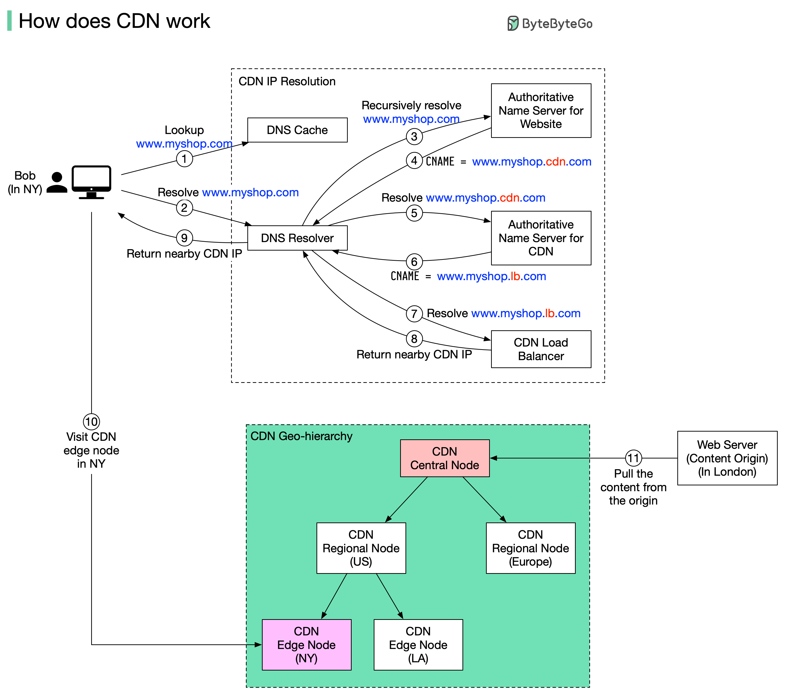

A content delivery nerwork (CDN) rfers to geographically distributed servers (also called edge servers) that provide fast delivery of static and dynamic content.

Suppose Bob who lives in New York wants to visit an eCommerce website that is deployed in London. If the request goes to servers located in London, the response will be quite slow. So we deploy CDN servers close to where Bob lives, and the content will be loaded from the nearby CDN server.

How CDN works

- Bob types in www.myshop.com in the browser. The broswer looks up the domain name in local DNS cache.

- If the domain name does not exist in the local DNS. The DNS resolver usually sits i the Internet Service Provider (ISP)

- Then DNS resolver recursively resolves the domain name Finally, it asks the authoritative name server to resolve the domain name.

- If we don’t use CDN, the authoritative name server returns the IP address for www.myshop.com. But with CDN, the authoritative name server has an alias pointing to www.myshop.cdn.com (the domain name of the CDN server).

- The DNS resolver asks the authoritative name server to resolve www.myshop.cdn.com.

- The authoritative name server returns the domain name for the load balancer of CDN www.myshop.lb.com.

- The DNS resolver asks the CDN load balancer to resolve www.myshop.lb.com. The load balancer chooses an optimal CDN edge server based on the user’s IP address, user’s ISP, the content requested, and the server load.

- The CDN load balancer returns the CDN edge server’s IP address for www.myshop.lb.com.

- Now we finally get the actual IP address to visit. The DNS resolver returns the IP address to the browser.

- The browser visits the CDN edge server to load the content. There are two types of contents cached on the CDN servers: static contents and dynamic contents. The former contains static pages, pictures, videos; the latter one includes results of edge computing.

- If the edge CDN server cache doesn’t contain the content, it goes upward to the regional CDN server. If the content is still not found, it will go upward to the central CDN server, or even go to the origin - the London web server. This is called the CDN distribution network, where the servers are deployed geographically.

# ✅ **CDN Content Delivery Network**

## **1. CDN Market Overview**

- The CDN market is projected to reach **$38 billion by 2028**.
- Major players: **Akamai**, **Cloudflare**, **Amazon CloudFront**, and others.
- Companies are heavily investing due to increasing:

  - Video streaming,
  - Gaming,
  - Global traffic,
  - Low-latency requirements.

## **2. Impact of CDN**

CDNs significantly improve:

- **Performance** – by serving content closer to users.
- **Availability** – edge servers continue delivering even if origin has issues.
- **Bandwidth Cost Reduction** – caching reduces origin server load.
- **Latency Reduction** – shorter physical distance = faster delivery.

## **3. CDN Request Flow (Step-by-Step)**

1. **DNS Resolution**

   - User’s device resolves the domain → nearest CDN edge server IP.

2. **Request to Edge Server**

   - User sends content request to the assigned edge server.

3. **Edge Cache Lookup**

   - If **content is cached** → served immediately.
   - If **not cached**, edge server requests it from the **origin server**.

4. **Content Fetch + Store**

   - Edge receives the content from origin.
   - It **stores a copy** in cache for future requests.

5. **Response to User**

   - Edge server delivers the content to the user.

## **4. Architecture of a CDN**

### **a. Origin Server**

- The original and primary source of content.
- Usually located in a central location or cloud region.

### **b. Edge Servers**

- Distributed globally.
- Cache static content and serve users from nearby locations.

### **c. DNS**

- Resolves the domain to the **nearest** edge server based on:

  - Geography,
  - Network conditions,
  - CDN logic.

### **d. Control Plane**

- Manages configuration of CDN components.
- Handles tasks like:

  - Cache policies,
  - Security rules,
  - Routing policies,
  - Edge server updates.

## **5. CDN Request Routing Techniques**

### **a. GSLB (Global Server Load Balancing)**

Routes user requests based on:

- Geographic proximity,
- Server load,
- Network traffic conditions,
- Latency measurements.

### **b. Anycast DNS**

- Multiple CDN servers share **the same IP address**.
- The internet routing system delivers the request to the **nearest or best-performing** data center.

### **c. Internet Exchange Points (IXPs)**

- CDNs place edge servers at major IXPs.
- Allows **direct traffic exchange** with ISPs.
- Results in:

  - Lower latency,
  - Reduced routing hops,
  - Faster delivery.

## **6. Best Practices for CDN Optimization**

### **Security**

- Enable HTTPS everywhere.
- Use WAF, DDoS protection, bot protection.
- Validate and secure edge configurations.

### **Caching Optimization**

- Configure caching headers properly:

  - `Cache-Control`
  - `ETag`
  - `Expires`

- Use tiered caching and smart invalidation.

### **Content Optimization**

- Compress assets (Gzip, Brotli).
- Minify JS/CSS/HTML.
- Use WebP/AVIF images.
- Leverage edge compute for dynamic content.
