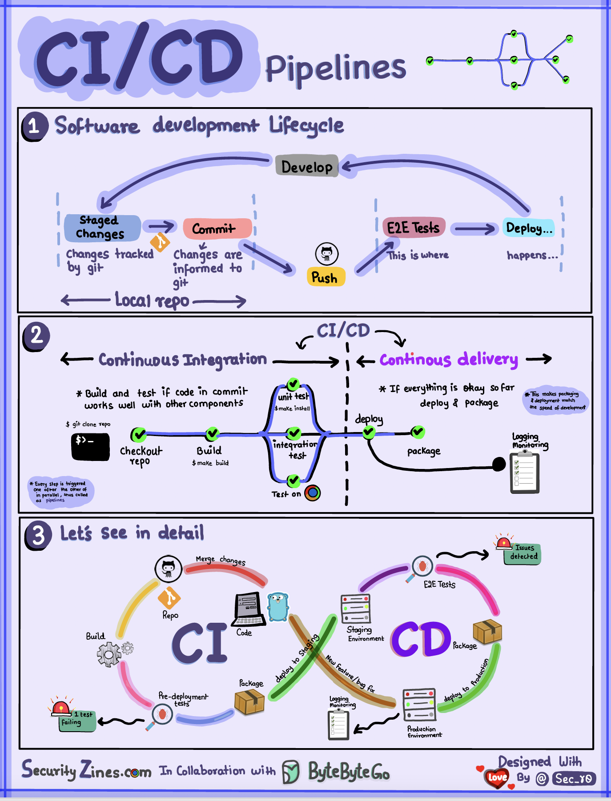
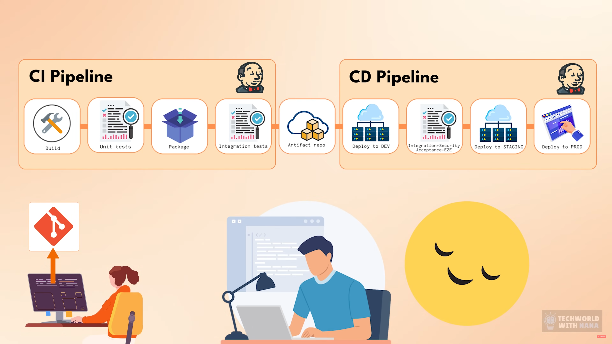
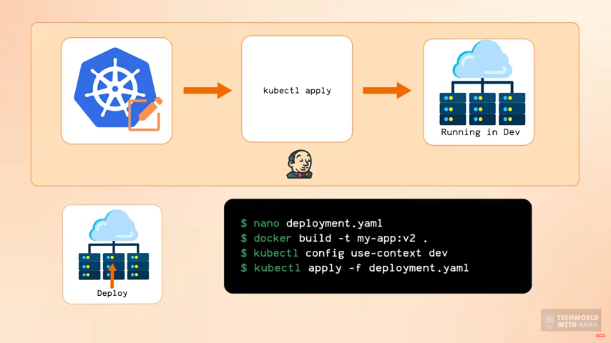
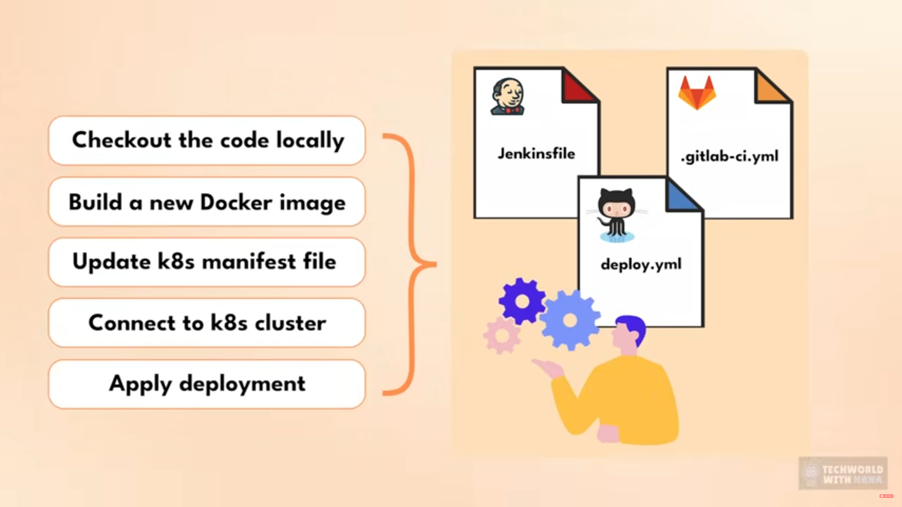
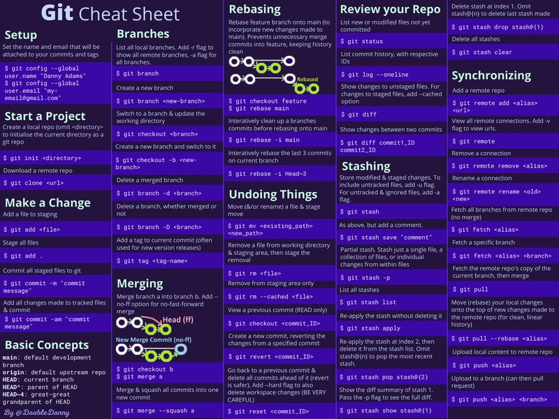

# 🔵 **CI/CD Pipelines**



## SDLC with CI/CD

The software development life cycle (SDLC) consists of several key stages: development, testing, deployment, and maintenance. CI/CD automates and integrates these stages to enable faster, more reliable releases.

When code is pushed to a git repository, it triggers an automated build and test process. End-to-end (e2e) test cases are run to validate the code. If tests pass, the code can be automatically deployed to staging/production. If issues are found, the code is sent back to development for bug fixing. This automation provides fast feedback to developers and reduces risk of bugs in production.

## Difference between CI and CD



`Continuous Integration` (CI) automates the build, test, and merge process. It runs tests whenever code is committed to detect integration issues early. This encourages frequent code commits and rapid feedback.

Every time we merge our feature branch to the main,
It would be more efficient if we ran those test cases and check issues in the feature branch itself.
Why do we need to wait for it to merge to test if it breaks anything, Also we have multiple branches we should test each individually before we merge them.
And what if we run the checks every commit to the branch so its easy to isolate the issue.
We need to commit small, frequently. test fast. fix early

#### 📊 Continuous Integration Flow

```
   Developer Commit
          │
          ▼
   ─────────────────────
   |   CI Pipeline     |
   |-------------------|
   | - Lint            |
   | - Build           |
   | - Unit Tests      |
   | - Integration     |
   ─────────────────────
          │
          ▼
     Result (Pass/Fail)
```

#### 📦 Continuous Delivery Pipeline

```
          Merge to Main
                │
                ▼
      ───────────────────────
      |      CI Stage       |
      |  (Build + Test)     |
      ───────────────────────
                │
      All Checks Green?
                │ Yes
                ▼
      ───────────────────────
      |   CD Stage           |
      | --------------------- |
      | - Build Docker Image |
      | - Tag Version        |
      | - Push to Registry   |
      | - Apply K8s Manifests|
      | - Deploy to Dev/Prod |
      ───────────────────────
```

`Continuous Delivery (CD)` automates release processes like infrastructure changes and deployment. It ensures software can be released reliably at any time through automated workflows. CD may also automate the manual testing and approval steps required before production deployment.


We need to avoid code freeze and devselopers locally checking out code building docker images ssh into the server or connect to current cluster and then manually deply the new application,
We need to `automate`, After all successful tests, if they are all green after being merged into the main branch, build the app into a docker image, give it the next version tag, push it to the docker registry, we have new artifact that is deployable, then connect to server or the cluster and run that newly build docker image container there, Or if we created a new deployment or service components for kubernates cluster or we made configuration changes to the application apply the changes in the dev environment


---

## CI/CD Pipeline

A typical CI/CD pipeline has several connected stages:

Developer commits code changes to source control

CI server detects changes and triggers build

Code is compiled, tested (unit, integration tests)

Test results reported to developer

On success, artifacts are deployed to staging environments

Further testing may be done on staging before release

CD system deploys approved changes to production

# Github Actions

## How does GitHub Actions automate development tasks?

### GitHub decreases time from idea to deployment

- `Communication:` Code reviews in pull requests, GitHub issues, project boards, wikis, notifications, and so on.

- `Automation:` GitHub Actions lets your team automate workflows at every step in the software-development process, from integration to delivery to deployment. It even lets you automate adding labels to pull requests and checking for stale issues and pull requests.

### Use workflow automation to decrease development time

Tasks that must happen after the code is written, but before we can reliably use the code for its intended purpose.
likely need to perform one or more of the following tasks:

- Ensure the code passes all unit tests.
- Perform code quality and compliance checks to make sure the source code meets the organization's standards.
- Check the code and its dependencies for known security issues.
- Build the code by integrating new source code from (potentially) multiple contributors.
- Ensure the software passes integration tests.
- Specify the version of the new build.
- Deliver the new binaries to the appropriate filesystem location.
- Deploy the new binaries to one or more servers.
- Determine if any of these tasks don't pass, and report the issue to the proper individual or team for resolution.

### What is GitHub Actions?

GitHub Actions are scripts that adhere to a ym data format. Each repo has an `Actions` tab that provides a quick and easy way to get started with setting up the script.
We can hit the configure button to add script


## Workflows Jobs and Steps

### **Workflow**

“A workflow is the entire CI/CD pipeline definition. It is triggered based on conditions like push, PR, or schedule.” It contains all the jobs you want to run.

- Stored inside: .github/workflows/<file>.yml

- Triggered by events:

       - push / pull_request

       - schedules (CRON)

       - manual triggers

       - GitHub events (issue created, release published, etc.)

### **Job**

“A job is a set of steps that run on the same runner. Jobs can run independently or in sequence using the `needs` keyword.”

- Define a Runner (exectuion environment)
- Contain one or more Steps
- Run in parallel (default) or sequential
- Can be conditional

### **Step**

“A step is an actual executable task inside a job. It can run commands or use GitHub Actions.”

- Execute a shell script or an action
- Can use custom or third party actions
- Steps are executed in order
- Can be conditional
