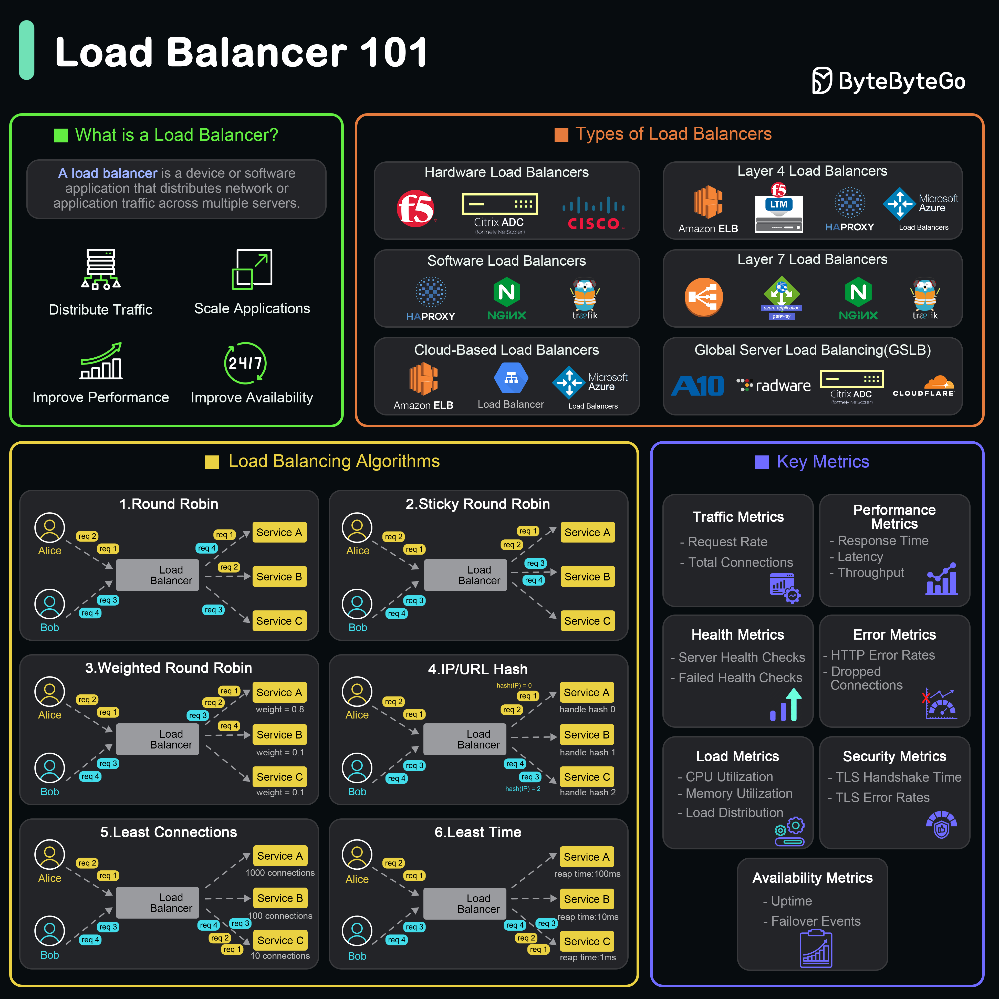

A **load balancer** sits between the client and server to distribute traffic, improve performance, and ensure high availability. Load balancers can operate at **Layer 4 or Layer 7**, be hardware, software, or cloud-based, and use algorithms like **round robin, weighted, sticky, least connections, least time,** and **hash-based routing**.

Monitoring metrics like **latency, health checks, CPU load, TLS errors, request rate**, and **availability** is crucial in production.

# 🟧 **Types of Load Balancers**

## 🔹 1. **Hardware Load Balancers**

Physical appliances used in on-prem data centers designed to distribute traffic across servers.
Examples:

- **F5**
- **Citrix ADC**
- **Cisco**

## 🔹 2. **Software Load Balancers**

Run on general-purpose servers can be installed on standard hardware or virtual machines
Examples:

- **HAProxy**
- **NGINX**
- **Traefik**

## 🔹 3. **Cloud-Based Load Balancers**

Provided by cloud service providers, these load balancers are integrated into the cloud infrastructure. Examples include AWS Elastic Load Balancer, Google Cloud Load Balancing, and Azure Load Balancer.
Managed LB solutions by cloud providers

Examples:

- **AWS ELB / ALB / NLB**
- **Azure Load Balancer**
- **GCP Load Balancer**

## 🔹 4. **Layer 4 Load Balancers**

Operate at the transport layer (OSI Layer 4) and make forwarding decisions based on IP address and TCP/UDP ports.

Balance traffic at **Transport Layer (TCP/UDP)**

Examples:

- **AWS NLB**
- **F5 LTM**
- **HAProxy (L4 modes)**
- **Azure Load Balancer**

## 🔹 5. **Layer 7 Load Balancers**

Operate at the application layer (OSI Layer 7)

Balance traffic based on **application-level data** (HTTP/HTTPS headers, cookies, paths)

Examples:

- **AWS ALB**
- **NGINX**
- **Traefik**

## 🔹 6. **Global Server Load Balancing (GSLB)**

Distributes traffic across multiple geographical locations to improve redundancy and performance on a global scale.

Distributes traffic **across regions/data centers**

Examples:

- **A10**
- **Radware**
- **Citrix ADC (global)**
- **Cloudflare Load Balancing**

---

# 🟨 **Load Balancing Algorithms**

## **1. Round Robin**

- Requests are distributed sequentially:
  Req1 → Server A
  Req2 → Server B
  Req3 → Server C
- Simple and fair when all servers have equal capacity.

## **2. Sticky (Session) Round Robin**

- Clients stick to the same server using session cookies or IP affinity.
- Useful for applications that store state in the server (not stateless).

## **3. Weighted Round Robin**

- Each server has a **weight** based on capacity.
- Server with higher weight receives more requests.

  - Example:
    Server A = weight 0.2
    Server B = weight 0.7
    Server C = weight 0.1

## **4. IP/URL Hash**

- Hashes client IP or request URL to decide the server.
- Ensures:

  - Consistent routing
  - Good for caching systems (reduces cache misses)
  - Ensures users hit the same server

## **5. Least Connections**

- Request goes to the server with the **fewest active connections**.
- Best for:

  - Long-lived connections
  - Uneven load distribution

## **6. Least Time**

- Chooses the server with:

  - **Least response time**
  - **Fewest active requests**

- Useful for performance-sensitive systems.

---

# 🟦 **Key Metrics for Load Balancing**

## 🔵 **Traffic Metrics**

- **Request Rate** – Number of incoming requests/sec.
- **Total Connections** – Total active connections being handled.

## 🔵 **Performance Metrics**

- **Response Time** – Time to respond to a client.
- **Latency** – Delay between request & response.
- **Throughput** – Amount of data served per second.

## 🔵 **Health Metrics**

- **Server Health Checks** – Periodic checks to ensure backend servers are working.
- **Failed Health Checks** – Detects unhealthy servers and removes them from rotation.

## 🔵 **Error Metrics**

- **HTTP Error Rates** – 4xx or 5xx spikes.
- **Dropped Connections** – Connections force-closed due to overload.
- **Timeout Errors** – Backend or LB timeouts.

## 🔵 **Load Metrics**

- **CPU Utilization**
- **Memory Utilization**
- **Load Distribution**
  Indicates if traffic is properly spread across servers.

## 🔵 **Security Metrics**

- **TLS Handshake Time** – Delay during secure connection setup.
- **TLS Error Rates** – Failure rates for secure connection attempts.

## 🟢 **Availability Metrics**

- **Uptime** – Availability of the load balancer.
- **Failover Events** – Count of failovers between regions / instances.

Here are **high-quality cross questions with strong, senior-level answers** based on the “Load Balancer 101” notes. These are the kind of follow-up questions interviewers ask when they want to go deep.

---

# 🔥 **Cross Questions & Answers on Load Balancers**

---

# ✅ **1. What happens if a server behind the load balancer becomes slow but not fully down?**

### **Answer:**

A slow server may still pass health checks if:

- Health checks only validate HTTP 200
- Health checks don’t measure response time
- Intervals are too wide

Because of this, the LB may continue routing traffic to a degraded server → causing higher latency for users.

### **Better practice:**

- Enable **active health checks** with response time thresholds
- Use **Least Time** or **Least Connections** algorithm
- Add **passive health checks** (auto mark server unhealthy on certain error thresholds)

---

# ✅ **2. Why do we need Layer 7 load balancing when Layer 4 already works?**

### **Answer:**

Layer 4 LB only looks at IP + TCP/UDP ports → very fast but “blind”.

Layer 7 LB reads HTTP headers, cookies, URL paths, methods, etc., enabling:

- Path-based routing (`/api`, `/static`)
- Host-based routing (`app1.example.com`)
- Can modify headers/cookies
- WAF integration
- Content-based routing (images to one cluster, API to another)

**TL;DR:**
L4 = fast, dumb load balancing
L7 = smart, application-aware

---

# ✅ **3. When should we NOT use sticky sessions?**

### **Answer:**

Avoid sticky sessions when:

- You want stateless microservices
- Scaling horizontally or auto-scaling frequently
- Using serverless or ephemeral servers
- Handling high traffic with uneven user distribution
- Using caching systems where consistency matters

Sticky sessions can create:

- **Uneven load** (same server gets heavy users)
- **Session loss** on server restart
- **No benefit in stateless systems**

Better alternative:
**Store session in Redis / database → LB becomes stateless.**

---

# ✅ **4. What’s the main difference between Weighted Round Robin and Least Connections?**

### **Answer:**

| Feature  | Weighted Round Robin              | Least Connections            |
| -------- | --------------------------------- | ---------------------------- |
| Based on | Static weight                     | Real-time active connections |
| Best for | Servers with different capacities | Long-lived connections       |
| Downside | Doesn’t consider real-time load   | Can fluctuate too frequently |

**Key point:**
WRR is static → Least Connections is dynamic.

---

# ✅ **5. Can a load balancer become a single point of failure? How do you avoid that?**

### **Answer:**

Yes, if there's only one instance.

### **Prevention mechanisms:**

1. **Active-passive failover**
   Standby LB takes over when active LB fails.

2. **Active-active load balancers**
   Multiple LBs running in parallel.

3. **Using managed LB services**
   AWS/GCP/Azure LBs are automatically HA.

4. **DNS-level failover or GSLB**
   If regional LB fails → route to another region.

---

# ✅ **6. How does Global Server Load Balancing (GSLB) work?**

### **Answer:**

GSLB uses:

- **Anycast routing**
- **DNS-level load balancing**
- **Geo-based routing**
- **Latency-based routing**
- **Health checks across regions**

A user gets routed to:

- Nearest region
- Lowest latency
- Healthiest data center

If one region fails → DNS routes users to another.

---

# ✅ **7. How do you handle session persistence in stateless microservices?**

### **Answer:**

Avoid sticky LB routing. Instead, store session/state externally:

- Redis
- DynamoDB
- MongoDB
- Memcached

This allows:

- Horizontal scaling
- Stateless service replicas
- Zero-downtime deployments

---

# ✅ **8. Why is Least Time algorithm better for latency-critical apps?**

### **Answer:**

Least Time considers:

- **Response time of each server**
- **Pending requests**

So, it always picks the:

- Fastest server
- Lowest latency
- Lowest queue time

This is optimal for:

- Trading systems
- Live streaming
- Real-time gaming

---

# ✅ **9. What is the difference between Active and Passive Health Checks?**

### **Active Health Checks**

LB sends periodic probes:
`/health` → Server responds with 200.

Used to detect failures proactively.

### **Passive Health Checks**

LB monitors real traffic.

- If server returns too many 5xx
- Or times out repeatedly
  → LB marks it unhealthy

### Why needed?

Passive checks detect failures _faster_ than active checks in real-world traffic.

---

# ✅ **10. How does hashing-based load balancing help in caching?**

### **Answer:**

IP/URL hashing maps a request to the same server every time.

This improves:

- Cache hit ratio
- Query performance
- Predictability of routing

If traffic goes to the same server consistently:

- Cached objects stay local
- No re-fetching from backend

---

# ✅ **11. What if a server becomes overloaded mid-traffic? How does the LB react?**

### **Answer:**

Behavior depends on algorithm:

- **Least Connections** → Starts sending fewer requests to overloaded server
- **Least Time** → Avoids slow server due to high latency
- **Passive health checks** may mark it unhealthy
- **Circuit breaker logic** can temporarily stop routing

---

# ✅ **12. What’s the difference between Throughput and Request Rate?**

### **Request Rate**

Number of requests per second
Example: 10,000 requests/sec

### **Throughput**

Amount of data processed per second
Example: 500 MB/sec

High request rate ≠ high throughput
(1000 small JSON requests ≠ 1 huge video request)

---

# ✅ **13. Why is TLS handshake time an important metric?**

### **Answer:**

TLS handshake = CPU heavy.

High handshake time means:

- LB CPU is overloaded
- Misconfigured TLS versions
- Bad cipher suite choice
- DDoS attacks on HTTPS endpoints

Optimizing TLS directly improves:

- Latency
- User experience
- Security

---

# ✅ **14. What is the difference between Latency and Response Time?**

### **Latency**

Time between client request → LB/server receiving it.

### **Response Time**

Total time from request → server processing → sending back response.

Latency is one part of response time, not the whole.
