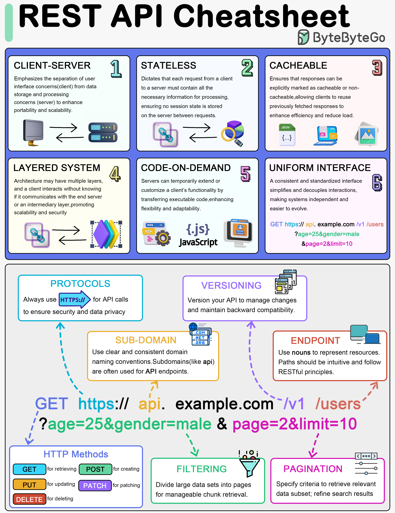
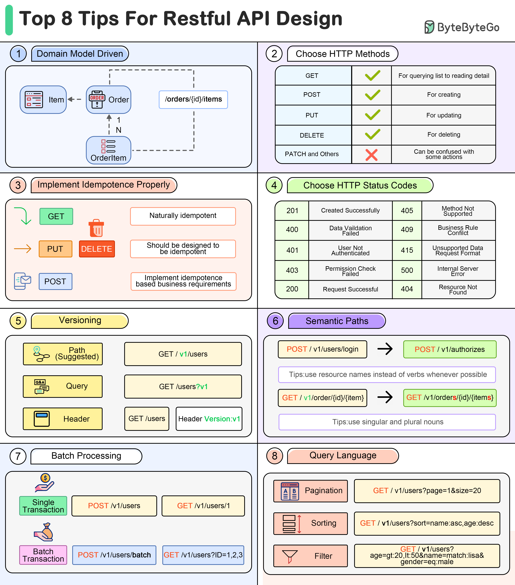

# ✅ **REST API**

---

## 🔹 What is REST?

# ✅ **REST API**


REST (Representational State Transfer) is an architectural style for designing networked applicaitons.

Key constraints:

- **Client–server** separation
- **Stateless**
- **Cacheable**
- **Uniform interface**
- **Layered system**
- **Optional: Code on demand**

### CLIENT-SERVER

Emphasizes the separation of user interface concerns(client) from data storage and processing concerns (server) so that both can evolve independently.

### STATELESS

Dictates that each request from a client to a server must contain all the necessary info for processing (auth token, data), ensuring no session state is stored on the server between requests.

### CACHEABLE

Ensures that responses can be explicitly marked as cacheable HTTP headers (ETag, Cache-Control) or non-cacheable allowing clients to reuse previously fetched responses to enhance efficiency and reduced load.

### LAYERED SYSTEM

Architecture may have multiple layers, and a client interacts without knowing if it communicates with the end server or an intermediary layer promoting scalability and security.

### CODE-ON-DEMAND

Servers can temporarily extend or customize a client's functionality by transering executable code, enhancing flexibility and adabtability.

### UNIFORM INTERFACE

A consitent and standardized interface simplifies and decouples interactions, making system independent and easier to evolve.

```url
GET https://api.example.com/v1/users?age=25&gender=male&page=2&limit=10


/users
/users/123
/products/10/reviews
```

---

## 🔹 What is a Resource?

Anything that can be identified—User, Order, Product.
Represented using **URLs (Uniform Resource Locators)**.

Example:

```
/users/123
/products/55
```

---

## 🔹 **What are HTTP Methods used in REST?**

- **GET** → Read / fetch data
- **POST** → Create
- **PUT** → Update entire resource
- **PATCH** → Partial update
- **DELETE** → Remove resource

## 🔹 Differences between PUT vs POST vs PATCH?

| Method | Idempotent? | Usage                         |
| ------ | ----------- | ----------------------------- |
| PUT    | Yes         | Replace the entire resource   |
| PATCH  | No          | Update a part of the resource |
| POST   | No          | Create resource               |

**Idempotent** → Multiple requests give the same result.

---

## 🔹 **5. What is Idempotency?**

An operation that produces the **same outcome** no matter how many times it is repeated.

Example:

- PUT `/users/10` (same update each time)
- DELETE `/users/10` (after first delete, further deletes have no effect)

POST is **not idempotent**.

---

## 🔹 **6. What are common HTTP status codes?**

### **2xx (Success)**

- `200 OK`
- `201 Created`
- `204 No Content`

### **3xx (Redirect)**

- `301 Moved Permanently`
- `302 Found`

### **4xx (Client Errors)**

- `400 Bad Request`
- `401 Unauthorized`
- `403 Forbidden`
- `404 Not Found`
- `409 Conflict`

### **5xx (Server Errors)**

- `500 Internal Server Error`
- `502 Bad Gateway`
- `503 Service Unavailable`

---

## 🔹 **7. What is statelessness in REST?**

Server does **not store client state**.
Each request contains all required information (auth token, metadata).

Frontend must send JWT/token **each request**.
The server can scale horizontally easily because requests don’t depend on earlier ones so any request can be served by any server in a cluster

---

## 🔹 **8. What are RESTful Best Practices?**

- Use **nouns**, not verbs → `/users`, not `/getUsers`
- Use **plural resource names**
- Use **proper HTTP methods**
- Use **status codes correctly**
- Support **filtering, sorting, pagination**

Example:

```
GET /products?category=mobile&sort=price&limit=10&page=2
```

---

## 🔹 **10. What is Caching in REST?**

**Caching in REST** is the mechanism of storing responses (usually on the client, browser, CDN, or proxy) so that subsequent requests for the same resource can be served faster **without hitting the server.**
HTTP caching improves performance.

### ⭐ Key Concepts of Caching in REST

#### Cacheable Responses

REST allows GET responses to be cached if the server marks them as cacheable.

Cache Validators
Two important headers ensure cached data is still fresh:
Client sends request with

```sql
If-None-Match: <etag>
```

Server responds:

    - `304 Not Modified` → use cached version
    - `200 OK with new data` → cache updated

##### Last-Modified

Server timestamp for the last update to resource.

```sql
If-Modified-Since: <timestamp>
```

REST leverages standard HTTP caching headers to control this behavior.

### Common headers:

- `Cache-Control`
- `ETag` (entity tag)
- `Last-Modified`
- `Expires`

#### Cache-Control Header

```
Cache-Control: max-age=3600
```

Cache valid for 1 hour.

```
Cache-Control: no-cache
```

Revalidate before using cache.

```
Cache-Control: no-store
```

Do not cache at all (used for sensitive data: auth, payments).

```
Cache-Control: public / private
```

- public → browsers + intermediaries (CDN, proxies) can cache

- private → only the client may cache

---

### ⭐ 4. Types of Caches

- Browser cache

- CDN (CloudFront, Akamai, Cloudflare)

- Proxy caches

- Microservice internal caching (Redis, Memcached)

#### 🔍 Example of a Cacheable GET Response

```arduino
HTTP/1.1 200 OK
Cache-Control: max-age=600, public
ETag: "v1.2.0"
```

- Browser is allowed to **use the cached response for 600 seconds (10 min)**
- Browser will treat the response as _fresh_ and may skip making a network request

#### **ETag: "v1.2.0"**

- A unique version identifier for the resource
- Helps in **validation** (only if max-age has expired)

#### Will this automatically stop API calls?\*\*

- **Browser-driven navigation (images, CSS, XHR)** → Yes, cache works automatically
- **Axios/fetch requests** → Not always
- **React apps making API calls** → Usually NOT cached unless configured
- **Cache-Control is only a _permission_, not a command\***

#### **Case A: max-age not expired**

The browser uses the cached response **without calling the server again**.

No network request.
No validation.
Just pure cache hit.

→ **Fastest case.**

#### **Case B: After 10 minutes (max-age expired)**

The browser will make a **conditional request**:

```
If-None-Match: "v1.2.0"
```

Server compares ETag →

- If unchanged → responds **304 Not Modified** (no body returned)
- If changed → responds **200 with new data**

#### ❌ **No. SPA frameworks (React, Angular, etc.) do NOT automatically use HTTP caching for API calls.**

Why?

Even with cache headers:

- `fetch()` defaults to **no-cache** behavior
- Many browsers treat XHR/fetch as “always hit the network unless cache-control: immutable”

#### You must explicitly enable caching:

```
fetch(url, { cache: "force-cache" })
fetch(url, { cache: "default" }) // allows browser heuristics
```

Or Axios:

```js
axios.get(url, { cache: true }); // but browser support varies
```

---

## 🔹 **What is the difference between authentication vs authorization?**

- **Authentication** → Who are you? (Login/JWT)
  - Logging in with email/password
  - OAuth login with Google
  - Providing a JWT token
  - Using API keys
- **Authorization** → What can you access?
  - Role-based access: admin, editor, viewer
  - Permission-based: can_delete, can_write

---

## 🔹 **What are rate limiting & throttling?**

Protect API from abuse.

- **Rate limiting** → X requests per time
- **Throttling** → Slow down when limits exceed

---

## 🔹 **13. What is pagination & why is it needed?**

To avoid sending huge datasets.

Patterns:

```
?page=2&limit=20
?offset=100&limit=20
?cursor=abc123
```

Cursor-based pagination → best for large scale or real-time feed.

---

## 🔹 **14. What is versioning?**

APIs evolve → breaking changes need versioning.

Styles:

- URI based → `/v1/users`
- Header based → `Accept: application/vnd.myapp+json;version=1`
- Query based → `/users?version=1`

Best practice → URI based.

---

## 🔹 **What is CORS?**

Cross-Origin Resource Sharing.
Browser security model controlling which domains can access a resource.

Key headers:

```
Access-Control-Allow-Origin: https://example.com
Access-Control-Allow-Methods: GET, POST
```

Pre-flight requests → `OPTIONS` request.

---

Here’s a **simple, clean, interview-ready explanation** of **protocols**:

---

## ✅ **What are Protocols?**

A **protocol** is a set of **rules, standards, and formats** that define **how two systems communicate** over a network.

Think of a protocol as the _language_ computers use to talk to each other.

It specifies:

- how data is **structured**
- how data is **transmitted**
- how requests & responses are **interpreted**
- what happens when there are **errors**

### 🔥 **Everyday examples of protocols**

#### **1. HTTP / HTTPS**

Rules for communication between browser and server (web).

#### **2. TCP**

Reliable data transmission—ensures all packets arrive in order.

#### **3. UDP**

Fast but unreliable communication (used in video streaming, gaming).

#### **4. FTP**

File transfer between systems.

#### **5. SMTP**

Sending emails.

#### **6. DNS**

Converts domain names to IP addresses.

#### **7. WebSocket**

Full-duplex (two-way) real-time communication.

---

Here are **clean, interview-friendly explanations** for **subdomain** and **endpoint**, with examples so you quickly build intuition.

## ✅ **What is a Subdomain?**

A **subdomain** is a subdivision of a main domain, used to separate different sections, services, or environments of a website.

Structure:

```
<subdomain>.<domain>.<TLD>
```

Examples:

- `api.example.com` → API server
- `blog.example.com` → Blog
- `dev.example.com` → Development environment
- `assets.example.com` → Static files (CDN)

The main domain here is:

```
example.com
```

Subdomains help:

- Organize services
- Separate environments (dev/staging/prod)
- Provide isolation + security
- Use different servers for different purposes

---

## ✅ **What is an Endpoint?**

An **endpoint** is a specific **URL path** exposed by an API to perform an action or access a resource.

Structure:

```
<domain-or-subdomain>/<path>
```

Examples:

- `GET https://api.example.com/users`
- `POST https://api.example.com/login`
- `GET https://shop.example.com/products/42`

Endpoints are _actions_ on _resources_, like:

- `/users`
- `/users/123`
- `/orders/1/items`
- `/login`

### 🔥 **Subdomain vs Endpoint (Very Important Difference)**

| Concept       | What it refers to                           | Example               |
| ------------- | ------------------------------------------- | --------------------- |
| **Subdomain** | Location/section of your service            | `api.example.com`     |
| **Endpoint**  | Specific resource/action inside the service | `/users/10`, `/login` |

```
https://api.example.com/users/123
```

### Breakdown:

- `https` → protocol
- `api` → **subdomain**
- `example.com` → domain
- `/users/123` → **endpoint**

Below are **clean, conceptual, interview-quality notes** for **Top 8 Tips for RESTful API Design** — designed to show strong architectural thinking and mastery of REST principles.
These are crisp, easy to memorize, and fully conceptual **without losing depth**.

---

# 🚀 **RESTful API Design**



## 1️⃣ **Domain Model Driven Design**

### ✔ Concept

Design API endpoints to mirror your **domain model** (the real-world entities and their relationships).
APIs should reflect how your business objects interact.

### ✔ Why it matters

- Makes the API intuitive
- Keeps endpoints consistent with business logic
- Easier onboarding for new developers

### ✔ Principle

**Resources, not actions.**
If the model has `Order → OrderItem → Item`, the API should expose:

```
/orders/{id}/items
/items/{id}
/orders/{id}
```

## 2️⃣ **Choose Proper HTTP Methods**

### ✔ Concept

Use **standard HTTP verbs** to represent CRUD operations clearly:

- **GET** – retrieve data
- **POST** – create new resource
- **PUT** – replace/update resource
- **DELETE** – remove resource

Avoid overusing PATCH unless truly necessary, as teams often misuse it.

### ✔ Why it matters

- Predictable behavior
- Aligns with REST conventions
- Reduces confusion across clients

## 3️⃣ **Implement Idempotence Properly**

### ✔ Concept

Idempotence means **calling the same API multiple times results in the same outcome.**

- GET → always idempotent
- PUT / DELETE → must be idempotent by definition
- POST → **not idempotent**, so you must design special rules (idempotency keys)

### ✔ Why it matters

- Prevents duplicate records
- Essential for retry logic (network failures, load balancer retries)
- Improves reliability in distributed systems

### ✔ Example

Using **Idempotency-Key** header to avoid duplicate payments/orders.

## 4️⃣ **Use Appropriate HTTP Status Codes**

### ✔ Concept

Use a small, consistent set of codes to communicate outcomes:

- **200** – OK
- **201** – Created
- **400** – Validation error
- **401** – Unauthenticated
- **403** – Forbidden
- **404** – Not found
- **409** – Business conflict
- **500** – Server error

### ✔ Why it matters

- Better debugging experience
- Easier API documentation
- Avoids ambiguous client behavior

Keep the set small to avoid confusion and inconsistent usage.

## 5️⃣ **Versioning**

### ✔ Concept

Always version your API to allow evolution without breaking existing clients.

### Common approaches:

- **Path versioning:** `/v1/users` → recommended
- **Query parameter versioning:** `/users?v=1`
- **Header versioning:** `Version: 1`

### ✔ Why it matters

- Allows backward compatibility
- Enables safe rollout of major changes
- Simplifies long-term maintenance

## 6️⃣ **Semantic Paths**

### ✔ Concept

API endpoints should be **meaningful, predictable, and noun-based**.

### Principles:

- Use **nouns, not verbs** in paths

  ```
  POST /v1/users/login ❌
  POST /v1/sessions      ✔
  ```

- Use **plural nouns**

  ```
  /users, /orders, /items
  ```

- Use nested resources to show relationships

  ```
  /orders/{id}/items
  ```

### ✔ Why it matters

- More intuitive
- Easier for consumers to search and guess endpoints
- Better documentation experience

## 7️⃣ **Batch Processing**

### ✔ Concept

Allow the client to perform operations on **multiple resources** in one request.

Example:

```
POST /v1/users/batch   // create multiple users
GET /v1/users?ID=1,2,3 // fetch multiple users
```

### ✔ Why it matters

- Reduces round-trip time
- Great for mobile apps and slow networks
- Less overhead on server (fewer HTTP connections)

### ✔ Two approaches:

1. **Single transaction** → all succeed or fail
2. **Batch transaction** → partial success allowed

## 8️⃣ **Query Language (Filtering, Sorting, Pagination)**

### ✔ Concept

Define a consistent, predictable structure for querying large collections.

### Include:

- **Pagination**
  `/v1/users?page=1&size=20`
- **Sorting**
  `/v1/users?sort=name:asc,age:desc`
- **Filtering**
  `/v1/users?gender=male&age[gt]=20`

### ✔ Why it matters

- Improves API flexibility
- Avoids having to create many special endpoints
- Enhances client-side control without backend changes

# ✅ **What is the OPTIONS method in REST API?**

The **OPTIONS** method is used to determine which HTTP methods and headers are allowed on a resource, and it is mainly used by browsers for CORS preflight checks.:

> **“What HTTP methods, headers, and operations are allowed on this resource?”**

It does **NOT** change or fetch data.
It is mainly used for **CORS preflight** requests in browsers.

## 🔍 **Where do you see OPTIONS in real life? (Very common)**

When your frontend (React/Next.js) calls an API on a different domain:

```
https://frontend.com  →  https://api.backend.com
```

The browser first sends an **OPTIONS preflight request**:

```
OPTIONS /users
Origin: https://frontend.com
Access-Control-Request-Method: POST
Access-Control-Request-Headers: Content-Type
```

The server responds with:

```
HTTP/1.1 204 No Content
Access-Control-Allow-Origin: https://frontend.com
Access-Control-Allow-Methods: GET, POST
Access-Control-Allow-Headers: Content-Type
```

Only if this is allowed, the browser will **send the actual POST request** next.

## ⭐ **Why does OPTIONS exist?**

### ✔ To check if API is safe to call

### ✔ To enforce browser security (CORS)

### ✔ To tell client which methods are allowed

### ✔ To avoid sending unnecessary calls that would fail

### ✔ To validate custom headers (Authorization, Content-Type, etc.)

---

# REST API Design


## **1. Domain Model Driven API Design**

Domain-model-driven API design means your API endpoints directly reflect the "nouns" in your business domain. Instead of designing endpoints randomly or action-based, you first understand:

- **Entities** in your system (User, Order, Product, Transaction)
- **Relationships** between entities (Order → OrderItems)
- **Bounded contexts** (Payments, Inventory, Authentication)

Your REST structure is a reflection of these models.

This results in the API being intuitive, consistent, predictable, and easier for clients to navigate even without reading documentation.

### **Example**

Domain Model:

- Order
- Item
- OrderItems (1-to-many)

API:

```
/orders
/orders/{orderId}
/orders/{orderId}/items
```

### **Why It Matters**

- Prevents chaotic API design
- Reduces documentation dependency
- Easy extensibility (future-proof)
- Developers can guess endpoints from domain
- Helps microservices maintain clear bounded contexts

#### ❓ **Q: Why shouldn't we use verbs in REST paths?**

**A:** Because HTTP methods themselves describe the action. The path should only describe the resource. For example:

- `GET /users` → Fetch users
- `POST /users` → Create user

If we use `/getUsers` or `/createUser`, we are violating REST constraints and creating redundancy.

#### ❓ **Q: How do you design APIs for complex, deeply nested models?**

**A:** General rules:

- If child resource makes sense only under parent → use nested path.
  `/orders/{id}/items`
- If child resource is standalone → separate resource.
  `/items/{itemId}`

Use nesting only 1–2 levels deep. More than that becomes anti-pattern.

#### ❓ **Q: When do you avoid nesting?**

**A:** If nested resource can be independently queried:
Bad:

```
/users/{id}/transactions/{transactionId}
```

Prefer:

```
/transactions/{transactionId}
```

And use query params if needed:

```
/transactions?userId=123
```

---

## **2. Choosing HTTP Methods Properly**

REST relies heavily on correct usage of HTTP methods. Proper usage ensures predictability, good caching behavior, idempotency guarantees, and alignment with API industry standards.

#### **GET** – Safe & Idempotent

- Should never modify server state
- Should be cacheable

#### **POST** – Non-idempotent create

- Used for creating new resources
- Server generates the ID

#### **PUT** – Idempotent full update

- Replaces full representation of resource
- Client is responsible for providing the full object

#### **PATCH** – Partial update

- More complex due to partial merging
- Best used with JSON Patch or JSON Merge Patch

#### **DELETE** – Idempotent delete

- Multiple calls should give same result

#### **Why It Matters**

Correct usage determines:

- How load balancers and caches treat your traffic
- Retry safety
- Ability to horizontally scale
- API reliability in distributed environments

#### ❓ **Q: Why is PATCH often avoided?**

**A:** Because implementing partial update requires careful handling of:

- Null vs missing fields
- Partial validation rules
- Concurrency
- Conflict resolution

Teams prefer PUT because it's simpler and more predictable.

### #❓ **Q: Can POST ever be idempotent?**

**A:** Yes, if you implement an **Idempotency-Key** header.
Common in payments APIs.

---

## **3. Implementing Idempotence Properly**

Idempotence ensures that a request repeated multiple times results in the same effect as a single request.
Designing for idempotence in advance can improve the robustness of an API. GET method is idempotent, but POST needs to be designed properly to be idempotent.
This is extremely important in distributed systems due to retries by:

- API Gateways
- Reverse proxies
- Mobile networks
- Cloud functions
- Load balancers

#### **GET** – Always idempotent

Multiple calls return same data.

#### **DELETE** – Should be idempotent

Deleting an already-deleted resource returns 200 or 204.

#### **PUT** – Idempotent by design

Replacing resource with same payload gives same result.

#### **POST** – Not idempotent unless implemented explicitly

Use `Idempotency-Key` header to enforce.

#### ❓ **Q: Why is idempotency critical for POST in payment systems?**

**A:** Because payment gateways retry requests, and without idempotency, it may charge a customer twice.

#### ❓ **Q: How do you implement idempotency tokens?**

**A:**

1. Client generates a UUID
2. Sends: `Idempotency-Key: <uuid>`
3. Server stores token and result
4. Repeated request returns same response

---

## **4. Choosing Proper HTTP Status Codes**

Using the right status code improves API readability, debugging, monitoring, and client behavior. Define a limited number of HTTP status codes to use to simplify application development.

## **Important Status Codes**

#### **200 – OK**

#### **201 – Created**

#### **204 – No Content**

#### **400 – Bad Request**

#### **401 – Unauthorized** (Auth required)

#### **403 – Forbidden** (Auth provided but insufficient permission)

#### **404 – Not Found**

#### **409 – Conflict** (duplicate, version mismatch)

#### **500 – Server Error**

#### ❓ **Q: Difference between 401 and 403?**

**A:**

- **401** → Authentication missing or invalid
- **403** → Authentication is valid, but user has no permission

#### ❓ **Q: When to use 409 Conflict?**

**A:**

- Duplicate email
- Version/ETag mismatch
- Updating stale resource

---

# **5. API Versioning (Deep Explanation)**

Versioning is required when _breaking changes_ occur. Designing the version number for the API in advance can simplify upgrade work.

## **Versioning Approaches**

#### **1. Path Versioning (Recommended)**

```
/v1/users
```

#### **2. Header Versioning**

```
Accept: application/json; version=1
```

#### **3. Query Parameter Versioning**

```
/users?v=1
```

#### ❓ **Q: When should you bump your version?**

**A:** Only when backward-incompatible changes happen.

#### ❓ **Q: Should deprecations also introduce new versions?**

**A:** No. Use: `Deprecation` header + sunset policy.

---

## **6. Semantic Paths**

Using semantic paths makes APIs easier to understand, so that users can find the correct APIs in the documentation

Semantic paths follow consistent rules:

- Use **plural nouns** for collections (`/users`)
- Use **singular nouns** for unique resources (`/users/{id}`)
- Use **hierarchy** for relationships

### ❓ **Q: How do you design login/logout APIs without verbs?**

**A:**

- For login: `POST /sessions`
- For refresh tokens: `POST /sessions/refresh`
- For logout: `DELETE /sessions/{id}`

---

## **7. Batch Processing**

Batch APIs allow sending multiple items in one request.Use batch/bulk as a keyword and place it at the end of the path

### **Types**

- **1. Non-Transactional Batch** – partial success allowed

- **2. Transactional Batch** – all-or-nothing commit

#### ❓ **Q: Should batch APIs be async?**

**A:** For large jobs, yes. Return `202 Accepted` with job ID.

## **8. Query Language (Filtering, Sorting, Pagination)**

### **Concept**

Query parameters make APIs flexible, powerful, and avoid over-fetching.

### **Filtering**

```
/users?gender=male&age_gte=25
```

### **Sorting**

```
/users?sort=age:desc,name:asc
```

### **Pagination**

```
/users?page=1&size=20
```

## **Offset vs Cursor Pagination**

### **Offset** – simpler, slower for large pages

### **Cursor** – faster, suitable for infinite scroll & real-time feeds

### ❓ **Q: Why cursor pagination is better?**

**A:** No performance degradation with large offsets. Stable for real-time updates.
