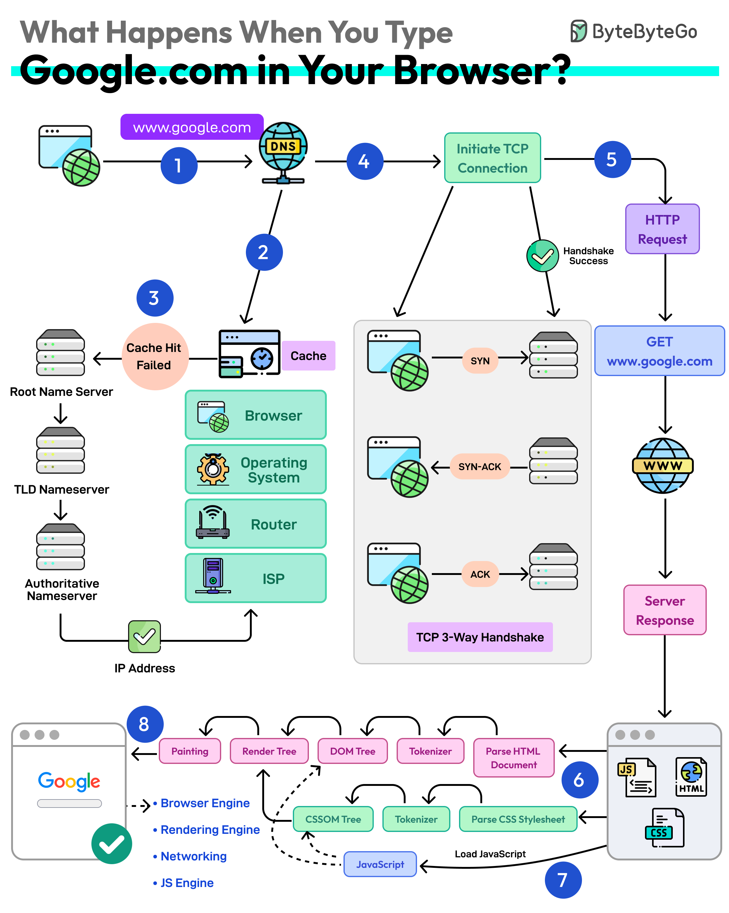
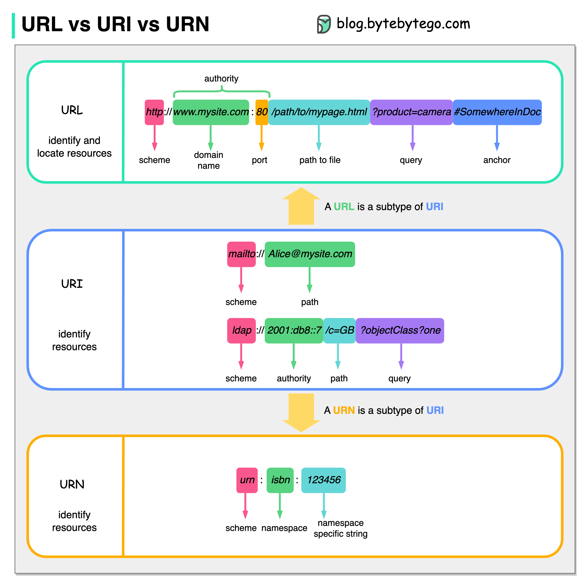

## **🚀 Browser Rendering Pipeline**

### **1. HTML Parsing → DOM Tree**

- Browser receives HTML from the server.
- Starts parsing _immediately_ using the HTML parser.
- Creates the **DOM (Document Object Model)** — a tree structure representing all HTML elements.

### **2. CSS Parsing → CSSOM Tree**

- Browser downloads external CSS files + parses inline & embedded CSS.
- Builds the **CSSOM (CSS Object Model)** — a tree of all CSS rules.

### **3. DOM + CSSOM → Render Tree**

- Browser combines DOM + CSSOM.
- Output is the **Render Tree**, which contains:

  - Only **visible** nodes.
  - Omits things like:

    - `<head>`
    - Elements with `display: none`.

### **4. Layout (Reflow)**

- Browser calculates:

  - Element positions
  - Widths, heights
  - Margins, paddings

- This produces the **geometry** of each node in the render tree.

### **5. Painting (Rasterization)**

- Browser converts layout information into actual **pixels**.
- Draws:

  - Text
  - Colors
  - Images
  - Borders
  - Shadows

### **6. Display (Compositing)**

- GPU takes rasterized layers.
- Composes them on screen.
- Final visual page appears.

### **Flow Summary**

**HTML → DOM → CSSOM → Render Tree → Layout → Paint → GPU → Screen**

---

## How Browsers Work

**Navigation → DNS lookup → TCP handshake → TLS negotiation → HTTP request/response → Parsing (HTML/CSS/JS) → Build DOM & CSSOM → Render tree → Layout → Paint → Compositing → Interactivity (TTI).**

**Goal:** minimize time from navigation to interactive page (reduce latency, blocking, main-thread work).

### Navigation

- Any user action that requests a page: address bar, link click, form submit, history navigation.
- Web performance goal: minimize navigation completion time (latency and bandwidth are key adversaries).

### DNS lookup

The first step of navigating to a web page is finding where the assets for that page are located. If you navigate to https://example.com, the HTML page is located on the server with IP address of 93.184.216.34. If you've never visited this site, a DNS lookup must happen.

- After this initial request, the IP will likely be cached for a time, which speeds up subsequent requests by retrieving the IP address from the cache instead of contacting a name server again.
- Each unique hostname referenced by page assets (fonts, images, scripts, third-party) can require its own DNS lookup.
- **Mobile**: extra hops (phone → cell tower → carrier core → DNS) increase latency compared to desktop (local cache, ISP DNS, fewer intermediaries).

### TCP handshake (three-way)

1. **SYN (Synchronize) - Client to Server**: - The client sends a TCP packet with the SYN (synchronize) flag set to the server, indicating a request to establish a connection. This packet also includes an initial sequence number (ISN), which is a random number used to start the communication.
2. **SYN-ACK (Synchronize-Acknowledge) - Server to Client**: - The server responds with a SYN-ACK packet. This packet has both the SYN flag (to synchronize) and the ACK (acknowledge) flag set. The server also sends its own sequence number and acknowledges the client's sequence number by setting the acknowledgment number to the client's ISN + 1.
3. **ACK (Acknowledge) - Client to Server**: - The client sends an ACK packet back to the server, acknowledging the server's sequence number by setting the acknowledgment number to the server's ISN + 1. This finalizes the connection setup, allowing data transmission to begin. Once this handshake is complete, the TCP connection is established, and can flow between the client and server reliably.data c

### TLS negotiation (TLS handshake)

- TLS (Transport Layer Security) negotiation, also known as the TLS handshake, is a process that establishes a secure connection between a client (e.g., a web browser) and a server (e.g., a website). This handshake ensures that the data exchanged between them is encrypted and secure.

  1. **ClientHello**: supported TLS version, cipher suites, client random, SNI.
  2. **ServerHello**: chosen version/cipher, server random, certificate (public key).
  3. **ServerKeyExchange** (optional): e.g., DH params.
  4. **ClientAuth** (optional): server may request client cert.
  5. **ClientKeyExchange**: client sends pre-master secret encrypted with server public key.
  6. **ChangeCipherSpec** (both): switch to encrypted traffic.
  7. **Finished** (both): verify handshake integrity.

- Adds latency (round trips) but guarantees confidentiality and integrity.

### HTTP request & Response

- After TLS, browser sends HTTP GET for HTML.
- **Time To First Byte (TTFB):** time from request to first packet of response (first chunk ~14KB typical).
- Browser begins parsing HTML as soon as first bytes arrive — **progressive rendering** is possible.

### Congestion control / TCP slow start

- TCP uses a **congestion window (CWND)** (initially small: 1, 2, 4, or 10 MSS) and grows exponentially on ACKs until network capacity is probed.
- On ACK: CWND doubles; on packet loss/no ACK: CWND halves.
- Balances throughput and network congestion — impacts how fast resources can be transferred early in the connection.

### Parsing & Critical Rendering Path (CRP) — overview

**CRP** = steps browser takes to convert HTML/CSS/JS into pixels. Optimizing CRP speeds up FCP/TTI.

Sequence:

1. HTML parsing → **DOM** construction
2. CSS parsing → **CSSOM** construction
3. Combine DOM + CSSOM → **Render Tree**
4. **Layout** (reflow): compute geometry
5. **Paint** (rasterize) → **Compositing** (GPU layers)
6. Interactivity measurement: **TTI**

**HTML → DOM → CSSOM → Render Tree → Layout → Paint → GPU → Screen**

Key points:

- Scripts without `async/defer` block HTML parsing.
- External CSS is render-blocking (browser must build CSSOM before render tree).
- Preload scanner can fetch critical resources early while parser runs.

### Building the DOM tree

- HTML tokenization → tokens → AST-like structure → DOM nodes.
- More DOM nodes → longer construction time.
- Scripts (synchronous) can modify DOM during parsing → parser must pause until scripts execute.
- **Best practice:** keep critical HTML (above-the-fold) small; avoid large blocking scripts early.

### Preload scanner

- While main thread builds DOM, preload scanner detects high-priority resources (CSS, JS, fonts, images) and starts fetches in background.
- Helps avoid waiting until parser explicitly discovers resources.
- Still, blocking resources (sync scripts, CSS) will affect render.

### Building the CSSOM tree

- CSS parser reads stylesheets, constructs CSSOM. Starts from browser default UA stylesheet → applies rules in cascade order (specificity, importance).
- CSSOM must be ready to compute final styles for render tree.
- **Recalculate Style** in devtools shows cost of CSS parsing + computed style calculation.

### Render tree construction

- Combine DOM + CSSOM → render tree of **visible** nodes (exclude `<head>`, `display: none`).
- Each visible node assigned computed styles.
- Render tree used for layout and paint.

### Layout (Reflow)

- Traverse render tree to compute geometry (sizes & positions) relative to viewport.
- First layout is full; subsequent layout operations (reflows) may be partial or full depending on change.
- Image without declared dimensions causes subsequent reflow when dimensions are known.
- Layout must be fast — repeated reflows are costly.

### Paint (Rasterization)

- Convert layout boxes into pixels. First meaningful paint often occurs here.
- To keep 60fps (frame budget ≈ 16.67ms), style/reflow/paint must be quick.
- Large viewports (high pixel count) cost more to paint.
- Painting can produce multiple layers for compositing.

### Compositing

- When elements live on separate layers (e.g., due to `opacity`, `transform`, `will-change`, `<canvas>`, `<video>`), GPU composites layers—only changed layers must be repainted/recomposited.
- Layers improve repaint performance but increase memory cost; use sparingly.

### Interactivity & Time To Interactive (TTI)

- **TTI**: time from navigation to when page reliably responds to user input (within ~50ms).
- Even after paint, heavy JS parsing/execution on main thread can block interactions → high TTI.
- Large scripts (e.g., 2MB) can download quickly but still block main thread during parse/execute, causing jank.

### Other processes: JS compilation & Web Workers

- **JS parsed → AST → bytecode** (Ignition in V8) → executed. Hot code optimized by JIT compiler (TurboFan) into machine code.
- **Web Workers**: move heavy computation off main thread; communicate via messages. Useful for expensive tasks to keep UI responsive.

### Accessibility Tree (AOM)

- Constructed from DOM & semantics for assistive technologies (screen readers).
- Built alongside DOM; until AOM is built, assistive tech can't access content. Not modifiable by assistive tech.

### JavaScript Runtime Environment (browser)

Components:

- **JS Engine** (V8, SpiderMonkey, JavaScriptCore, Chakra)
- **Web APIs** (DOM, fetch, setTimeout, etc.)
- **Event loop** (tasks/microtasks)
- **Task queue** and **Microtask queue**

### JS Engine internals (V8 example)

1. **Tokenizer/Scanner (lexical analysis)** → tokens.
2. **Parser** → AST (Abstract Syntax Tree).
3. **Interpreter (Ignition)** → bytecode.
4. **Profiler / Type feedback** → detect hot code.
5. **Optimizing compiler (TurboFan)** → optimized machine code for hot paths.
6. **Deoptimization** if assumptions (types/shapes) break — fall back to interpreter.

Key concepts:

- **Type feedback**: profiling of runtime types used to optimize code for common cases.
- **Code shape**: objects with same property layout share the same “shape” (hidden class); engines optimize property access based on shape.
- **Inline caching**: cache property lookups for repeated shapes to speed property access.
- **Element kinds**: arrays labeled by element type (e.g., integer-only) for optimized loops.

### Memory Management & GC

- JS is garbage-collected. Historically GC could pause main thread.
- Modern V8 GC is largely concurrent, reducing main-thread pauses, but GC can still cause occasional frame drops.

### Speeding Up CSS & JS Delivery — Practical optimizations

**Goal:** parse and render HTML as fast as possible and reduce main-thread blocking.

### Optimizing critical (above-the-fold) delivery

- Structure HTML to deliver critical content first (server render or SSR).
- Inline small critical CSS for above-the-fold rendering; defer non-critical CSS. (Avoid large inlines.)
- Use critical CSS tooling to extract above-the-fold styles.

### CSS optimizations

- Inline _only_ small critical pieces.
- Split CSS: critical (inline) + rest (load asynchronously).
- Avoid large synchronous CSS that delays render.
- Use `preload` / `prefetch` / `preconnect` / `dns-prefetch` where appropriate.

### JS loading strategies

- Old approach: `<script>` at end of `<body>` to avoid parser blocking.
- Modern approach: use `async` or `defer` attributes:

  - **async**: download & execute as soon as ready; execution order not guaranteed.
  - **defer**: download while parsing; execute in order after document parsing finishes.

- Prefer `defer` for dependent-order scripts; `async` for independent scripts (analytics, ads).
- Avoid `document.write()` and DOM-manipulating scripts that must run during parsing.

### Resource hints & preload scanner

- Use `link rel="preload"` for high-priority fetch (fonts, hero images, critical JS/CSS).
- Preload scanner already helps; resource hints help prioritize even more.

### Reduce number/size of requests

- Compress assets (gzip, brotli).
- Minify JS/CSS/HTML.
- Use image optimization & responsive images (`srcset`, `sizes`).
- Combine requests where appropriate (but favor HTTP/2 multiplexing).

### Rendering optimizations (layout/paint)

- **Avoid layout thrashing:** batch DOM reads and writes; read-only first then writes.
- **Reserve image dimensions** (`width` & `height` or CSS aspect-ratio) to avoid reflow.
- **Use `will-change` and CSS transforms/opacities** to promote to layers (but sparingly).
- **Prefer transforms (translateZ, transform) over `top/left` changes** for animations to leverage compositing on GPU.
- **Minimize expensive CSS (box-shadow, filter) during animations.**

### Layers & compositing tradeoffs

- Promote only elements that truly benefit (animations, video, canvas).
- Layers = faster repaints for isolated updates, but higher memory overhead and potential paint cost during creation.

### JavaScript performance micro-tips

- Keep functions monomorphic (consistent argument types) to avoid deopt.
- Keep object shapes consistent; add properties in same order.
- Avoid creating many short-lived objects in hot loops (GC pressure).
- Use typed arrays where applicable for numeric-heavy workloads.
- Debounce/throttle expensive event handlers; use passive event listeners for scroll/touch.

---

# What Happens When You Type google.com Into a Browser?


First up, you type the website address in the browser’s address bar.

The browser checks its cache first. If there’s a cache miss, it must find the IP address.

DNS lookup begins (think of it as looking up a phone number). The request goes through different DNS servers (root, TLD, and authoritative). Finally, the IP address is retrieved.

Next, your browser initiates a TCP connection like a handshake. For example, in the case of HTTP 1.1, the client and server perform a TCP three-way handshake with SYN, SYN-ACK, and ACK messages.

Once the handshake is successful, the browser makes an HTTP request to the server and the server responds with HTML, CSS, and JS files.

Finally, the browser processes everything. It parses the HTML document and creates DOM and CSSOM trees.

The browser executes the JavaScript and renders the page through various steps (tokenizer, parser, render tree, layout, and painting).

Finally, the webpage appears on your screen.

---

# Important Things About HTTP Headers

HTTP requests are like asking for something from a server, and HTTP responses are the server’s replies. It’s like sending a message and receiving a reply.

An HTTP request header is an extra piece of information you include when making a request, such as what kind of data you are sending or who you are. In response headers, the server provides information about the response it is sending you, such as what type of data you’re receiving or if you have special instructions.

Here is a **clear, structured explanation** of the image you shared.
I’ll break it down into **two parts**: the **request headers**, the **response headers**, and what each one means in real browser–server communication.

## 🟨 **1. HTTP Request Headers (Browser → Server)**

These headers tell the server:

- What kind of content the browser expects
- What formats it supports
- Who the user is (via cookies)
- Where the request came from
- Caching preferences
- The type of browser making the request

### ✔ **Accept: image/webp**

The browser tells the server:

> “If possible, send me the resource in WebP format.”

Reason: WebP is smaller than JPG/PNG → better performance.

### ✔ **Accept-Encoding: gzip**

Browser says:

> “I support gzip compression; send compressed data.”

This reduces response size dramatically.

### ✔ **Cookie: name=ByteByteGo**

Browser sends cookies previously set by the server.

Used for:

- authentication (session id)
- personalization (dark mode)
- tracking

### ✔ **Cache-Control: max-age=604800**

Browser says:

> “I’m willing to use a cached version that is at most 7 days (604,800 seconds) old.”

This header affects client-side caching behavior.

### ✔ **Content-Type: text/html**

If the request has a body (e.g., POST), this tells the server its format.

Example:

- JSON API → `application/json`
- Form submission → `multipart/form-data`

### ✔ **Content-Length: 30**

Size of the request body (in bytes).

### ✔ **Referer: [https://bytebytego.com](https://bytebytego.com)**

The link/page that triggered this request.

Used for:

- analytics
- CSRF prevention
- click tracking

### ✔ **User-Agent: Mozilla/5.0**

Identifies:

- browser
- OS
- device

Servers sometimes use this for:

- device-based UI rendering
- analytics
- A/B testing

---

## 🟩 **2. HTTP Response Headers (Server → Browser)**

These headers tell the browser:

- What it is receiving
- Whether it can cache it
- What security policies apply
- What cookies should be stored
- What server software is running

Let’s explain each:

### ✔ **Access-Control-Allow-Origin: \***

This is a **CORS header**.

Server says:

> “Any domain is allowed to access this resource.”

If this were an API, this allows cross-origin requests.

### ✔ **Alt-Svc: h2=":433"; ma=604800**

Alternate Service header.

Server says:

> “This resource is also available over HTTP/2 on port 433.”

This helps browsers upgrade to faster protocol versions.

### ✔ **Cache-Control: max-age=604800**

Server tells browser (and CDN):

> “You may cache this response for 7 days.”

Works with the client’s `Cache-Control` to determine caching behavior.

### ✔ **Content-Type: image/webp**

Server tells browser what the response body actually is.

Matches one of the formats listed in the browser’s `Accept` request header.

---

### ✔ **Content-Length: 30**

Size of the response body.

### ✔ **Date: Mon, 29 May 2023 17:15:36 GMT**

Timestamp indicating when the server created the response.

Used for:

- caching
- debugging network latency

### ✔ **Set-Cookie: name=alex**

Server → browser cookie.

Browser stores:

```
name=alex
```

This cookie will be sent in future requests to this domain.

### ✔ **Server: gws**

Identifies server software
(GWS = Google Web Server).

both sides **how to communicate correctly**.

---

# URL, URI, URN



- **URI**

URI stands for Uniform Resource Identifier. It identifies a logical or physical resource on the web. URL and URN are subtypes of URI. URL locates a resource, while URN names a resource.

A URI is composed of the following parts:

```
scheme:[//authority]path[?query][#fragment]
```

- **URL**

URL stands for Uniform Resource Locator, the key concept of HTTP. It is the address of a unique resource on the web. It can be used with other protocols like FTP and JDBC.

- **URN**

URN stands for Uniform Resource Name. It uses the urn scheme. URNs cannot be used to locate a resource. A simple example given in the diagram is composed of a namespace and a namespace-specific string.

Below are **clean, structured, interview-ready conceptual notes** for all the performance metrics you listed — **PLUS practical, actionable ways to improve each metric** (frontend + backend + CDN + network optimizations).
I kept all your information intact and expanded it into a **full performance guide**.

---
