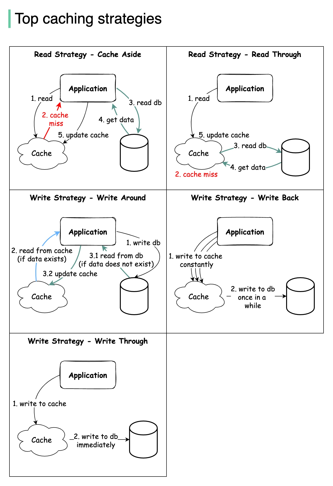
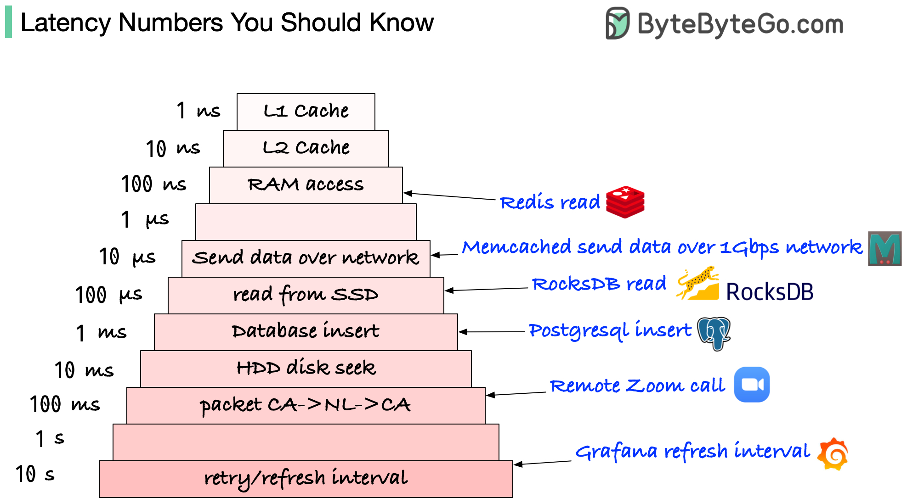

# 🚀 **Caching Strategies — Interview Notes (Conceptual + Practical)**

Caching improves read performance by storing frequently accessed data in fast storage (e.g., Redis).
But **how** you read and write to the cache determines the **consistency, performance, and complexity** of your system.

These are the **5 core caching strategies** every engineer should know:

## 🟦 **1. Cache Aside (Lazy Loading)**

**Read Strategy**

### ✔ Concept

Cache-aside, also known as lazy loading, is a caching pattern where the application checks a cache before querying the primary database. If the data is found (a cache hit), it is returned directly from the cache. If not (a cache miss)

### ✔ Workflow

1. App reads from cache
2. **Cache miss**
3. App queries DB
4. Receives data
5. Updates cache

### ✔ Pros

- Simple, easy to implement
- Cache updated only when needed → avoids storing unused data
- Works well with heavy-read workloads

### ✔ Cons

- First request is slow (cold cache)
- Cache can become stale unless invalidated properly
- DB can get hammered after cache eviction (cache stampede)

### ✔ Best Use Cases

- Read-heavy systems
- Data that doesn’t need real-time freshness
- User profile loading, product pages, blog content

---

## 🟦 **2. Read Through**

**Read Strategy**

### ✔ Concept

The cache itself, not the application, is responsible for fetching data from a backend database when a cache miss occurs. The application always interacts with the cache, and if the data isn't there, the cache retrieves it from the database, stores it, and then returns it to the application. This strategy simplifies the application code and is ideal for read-heavy workloads because it automatically handles data loading and improves performance by serving frequently accessed data quickly

### ✔ Workflow

1. App requests data from cache
2. **Cache miss**
3. Cache fetches from DB
4. Cache stores data
5. Returns to app

### ✔ Pros

- Cache and DB always in sync
- Cleaner application code (cache handles fallback)
- Prevents cache stampede through centralized control

### ✔ Cons

- Cache layer must understand DB access → more complexity
- Higher latency on first load compared to pre-warmed caches
- Cache backend must implement "read-through" logic (e.g., Redis module)

### ✔ Best Use Cases

- Systems requiring tight control over consistency
- Managed caches with built-in read-through support
- Enterprise caching frameworks

---

## 🟦 **3. Write Around**

**Write Strategy**

### ✔ Concept

A caching strategy where data is written directly to the primary storage (database), bypassing the cache entirely. The cache is only updated when the data is read later, ensuring that only frequently accessed data occupies the cache.

### ✔ Workflow

1. App writes to DB
2. Reads check cache
3. If not found → read from DB
4. Cache updated lazily

### ✔ Pros

- Prevents cache pollution (only cached if read)
- Useful when many writes but few reads

### ✔ Cons

- Cache may be stale until next read
- Slower reads after writes because value isn’t cached
- First read after write always a miss

### ✔ Best Use Cases

- Write-heavy workloads with low read frequency
- Logging systems
- Analytics batch writes

---

## 🟦 **4. Write Back (Write Behind)**

**Write Strategy**

### ✔ Concept

Write-back cache is a high-performance caching strategy where data is initially written only to the high-speed cache memory and the update of the main memory (or primary storage) is deferred to a later time. This asynchronous writing process significantly reduces write latency and conserves memory bandwidth by consolidating multiple changes into a single write operation to main storage.

### ✔ Workflow

1. App writes data to cache
2. Cache asynchronously flushes writes to DB (batched or periodic)

### ✔ Pros

- Extremely fast writes (RAM-speed)
- DB load reduced due to batching
- Useful for high-throughput write systems

### ✔ Cons

- Risk of data loss if cache crashes
- Complex to implement
- Data inconsistency window exists until DB sync

### ✔ Best Use Cases

- High write throughput systems
- Analytics ingestion
- Systems where slight delay in persistence is acceptable
- Game leaderboards, session stores, counters

---

## 🟦 **5. Write Through**

**Write Strategy**

### ✔ Concept

A write-through cache is a caching strategy in which data is written simultaneously to both the cache and the underlying main memory or permanent storage (like a database). The write operation is considered complete only after the data has been successfully written to both locations.

### ✔ Workflow

1. App writes to cache
2. Cache writes immediately to DB
3. Only after DB write succeeds → success returned

### ✔ Pros

- Strong consistency between cache and DB
- Cache always “warm” on reads
- No stale data

### ✔ Cons

- Slower writes (must wait for DB)
- Heavy DB load
- Not ideal for high write-throughput systems

### ✔ Best Use Cases

- Systems requiring strict consistency
- Financial transactions metadata
- Inventory updates
- User profile updates

---

# 🧠 **Summary Table (Interview-Ready)**

| Strategy          | Type  | How It Works                          | Pros                          | Cons                        | Best Use              |
| ----------------- | ----- | ------------------------------------- | ----------------------------- | --------------------------- | --------------------- |
| **Cache Aside**   | Read  | App loads data into cache _on demand_ | Simple, flexible              | Stale cache, cache stampede | Read-heavy workloads  |
| **Read Through**  | Read  | Cache auto-fetches from DB            | Centralized logic, consistent | Higher complexity           | Enterprise caching    |
| **Write Around**  | Write | Write → DB only                       | Avoids cache pollution        | First-read miss             | Write-heavy, low-read |
| **Write Back**    | Write | Write → cache → async DB write        | Fast writes, lower DB load    | Risk of data loss           | High-write systems    |
| **Write Through** | Write | Write → cache + DB                    | Strong consistency            | Slower writes               | Transactional systems |

---

# 🟢 **How Strategies Are Combined in Real Systems**

### **Common combinations**

1. **Cache Aside + Write Around**
   → Good for read-heavy systems with occasional writes.

2. **Read Through + Write Through**
   → Consistent and predictable caching model.

3. **Read Through + Write Back**
   → Fast writes + consistent read path (used in distributed caches).

### ⚠️ Always consider:

- Data consistency
- Cache eviction policies
- TTL (time to live)
- Failure modes
- Cache warm-up strategies

---

# 🔥 **How to Answer “Explain Caching Strategies” in Interviews**

**Sample Answer (use this):**

> “There are five core caching strategies: cache aside, read-through, write-around, write-through, and write-back.
> Cache aside is the most common, where the app checks the cache first and populates it on a miss. Read-through centralizes logic so the cache fetches missing data from the DB automatically. For writes, write-around writes only to the DB, write-through writes to both cache and DB synchronously, and write-back writes only to the cache and flushes changes to the DB asynchronously.
> These strategies allow trade-offs between performance, consistency, and complexity, and are often combined depending on workload patterns.”

---

# Latency Numbers Should You Know

## L1 and L2 caches: 1 ns, 10 ns

E.g.: They are usually built onto the microprocessor chip. Unless you work with hardware directly, you probably don’t need to worry about them.

## RAM access: 100 ns

E.g.: It takes around 100 ns to read data from memory. Redis is an in-memory data store, so it takes about 100 ns to read data from Redis.

## Send 1K bytes over 1 Gbps network: 10 us

E.g.: It takes around 10 us to send 1KB of data from Memcached through the network.

## Read from SSD: 100 us

E.g.: RocksDB is a disk-based K/V store, so the read latency is around 100 us on SSD.

## Database insert operation: 1 ms

E.g.: Postgresql commit might take 1ms. The database needs to store the data, create the index, and flush logs. All these actions take time.

## Send packet CA->Netherlands->CA: 100 ms

E.g.: If we have a long-distance Zoom call, the latency might be around 100 ms.

## Retry/refresh internal: 1-10s

E.g: In a monitoring system, the refresh interval is usually set to 5~10 seconds (default value on Grafana).

## Notes

1 ns = 10^-9 seconds 1 us = 10^-6 seconds = 1,000 ns 1 ms = 10^-3 seconds = 1,000 us = 1,000,000 ns
