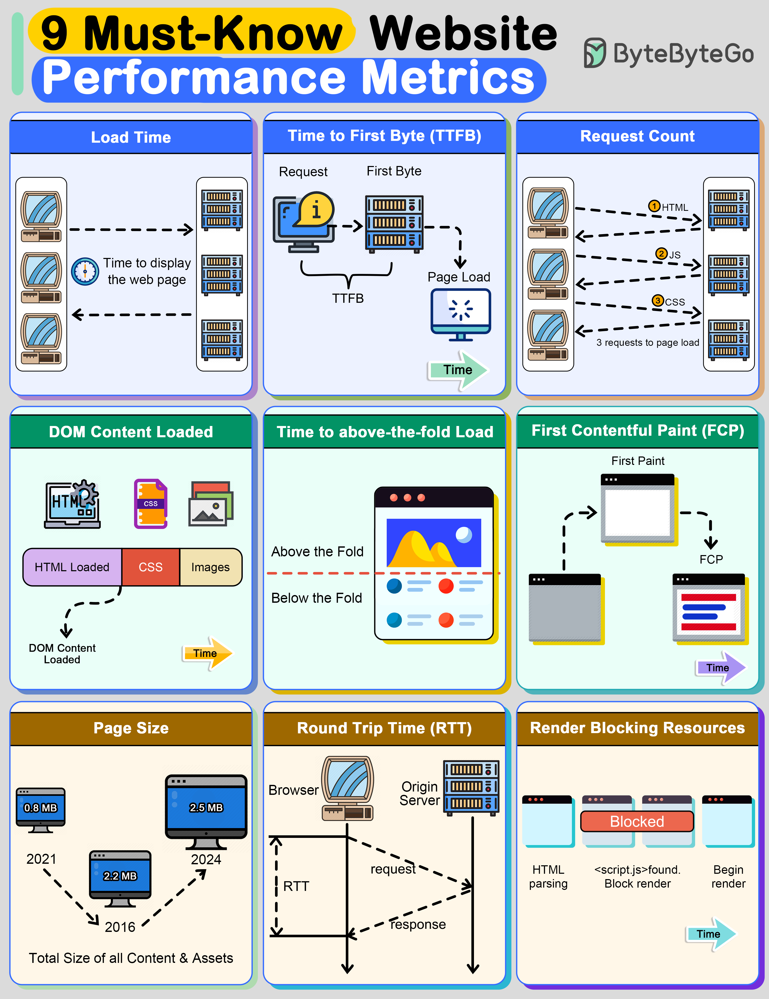

# 🚀 **Web Performance Metrics — Notes + How to Improve Them**

These metrics measure how fast a webpage loads, becomes visible, and becomes _usable_ for the user. They are essential for frontend system design, UI performance rounds, and web optimization work.

## 1️⃣ **Load Time**

The total time taken for the **entire webpage** (HTML + CSS + JS + images + fonts + APIs) to download and fully render.
Measured in milliseconds.

**Why it matters**
Affects bounce rate, SEO ranking, and user satisfaction.

### ✅ How to Improve

- Reduce page size (images, fonts, JS bundles)
- Minimize number of HTTP requests
- Enable gzip/Brotli compression
- Use caching: `Cache-Control`, `ETag`, `Last-Modified`
- Code-split JavaScript (load only what page needs)
- Lazy-load non-critical images and scripts
- Avoid heavy synchronous JS on page load

## 2️⃣ **Time to First Byte (TTFB)**

Time taken from user request to the browser receiving the _first byte_ from the server.

**What affects TTFB?**

- Slow backend processing
- Database slowness
- High network latency
- No CDN
- Server overload

### ✅ How to Improve

- Use a CDN for static and even dynamic content (edge SSR)
- Optimize backend logic & queries
- Use caching: Redis, CDN edge cache
- Reduce server middleware layers
- Use faster infrastructure (HTTP/2+, QUIC)
- Use keep-alive connections

## 3️⃣ **Request Count**

The total number of HTTP/S requests needed to load the page.

**More requests = more overhead & slower page.**

### ✅ How to Improve

- Combine CSS/JS where needed (but not too large — balanced bundling)
- Use SVG icons instead of PNG sprites
- Use HTTP/2+ (which handles more simultaneous requests)
- Lazy load non-critical images, videos, JS chunks
- Inline critical CSS
- Remove unused scripts / third-party trackers
- Use “preload” for high-priority assets

## 4️⃣ **DOMContentLoaded (DCL)**

Time until the **HTML is fully parsed** and the DOM is built.
Does _not_ wait for CSS, images, fonts, or JS execution.

### Why it matters

A faster DOM allows faster interaction readiness.

### ✅ How to Improve

- Minimize inline script blocking
- Defer non-critical JS (`<script defer>`)
- Remove unnecessary DOM complexity
- Stream HTML (server-sent HTML chunks)
- Keep HTML small & clean
- Avoid heavy JS modifying DOM during parsing

## 5️⃣ **Time to Above-the-Fold Load**

Time until the content visible _without scrolling_ is rendered. This is the content that is first seen by the user and often dictates whether they’ll continue reading the webpage.
This is often tied to **perceived performance**.

### Why it matters

This is what users see first → impacts engagement.

### ✅ How to Improve

- Inline critical CSS (Critical Rendering Path optimization)
- Optimize hero image (compress, use WebP/AVIF)
- Preload key above-the-fold images, fonts, and CSS
- Minimize render-blocking JS
- Use skeleton UIs or placeholders
- Avoid layout shift (important for CLS)

## 6️⃣ **First Contentful Paint (FCP)**

Time until **any content** first appears:

- text
- image
- background color
- SVG

### Why it matters

This is a direct perception metric: _“Ah, the website is loading.”_

### ✅ How to Improve

- Reduce server response time (TTFB)
- Inline critical CSS
- Preload above-the-fold elements
- Remove render-blocking scripts
- Serve images in next-gen formats (WebP, AVIF)
- Use optimized font loading (font-display: swap)

## 7️⃣ **Page Size**

This is the total file size of all content and assets that appear on the page. Over the last several years, the page size of websites has been growing constantly. The bigger the size of a webpage, the longer it will take to load

- HTML
- CSS
- JS
- images
- fonts
- videos

Larger page → slower network transfers → slower load.

### Common causes of large page size

- high-resolution images
- large JS bundles
- unoptimized fonts
- unused libraries

### ✅ How to Improve

- Compress images (WebP, AVIF, responsive ``)
- Compress JS/CSS (gzip/brotli)
- Remove unused JavaScript/CSS (tree shaking)
- Compress fonts (WOFF2)
- Lazy load heavy components
- Serve media through CDNs

## 8️⃣ **Round Trip Time (RTT)**

Time for a request to go:
browser → server → browser
(measured in ms)

RTT = propagation delay + server processing delay

### Why it matters

Higher RTT → slower loading, especially on mobile or global users.

### ✅ How to Improve

- Use CDN or edge servers (reduces geographical distance)
- Use HTTP/3 (QUIC reduces handshake latency)
- Persistent connections (HTTP Keep-Alive)
- DNS prefetching & preconnect
- Reduce redirects (each redirect = 1 more RTT)

## 9️⃣ **Render-Blocking Resources**

Resources (CSS, JS) that **block** the browser from rendering content until they are downloaded + parsed.

Render-blocking examples:

- `<link rel="stylesheet">`
- synchronous `<script>` tags

### Why it matters

Every blocked moment delays FCP and above-the-fold content.

### ✅ How to Reduce Render-Blocking Resources

- Inline critical CSS
- Defer JavaScript (`<script defer>`)
- Async scripts (`<script async>`)
- Minify and compress CSS/JS
- Split CSS into critical + non-critical
- Use preload for high-priority CSS
- Avoid large third-party scripts

## 🧠 **Ultimate Performance Improvement Checklist (Practical)**

### **Server-Side**

- Use CDN (Cloudflare, Akamai, Fastly)
- Use HTTP/2 or HTTP/3
- Lower TTFB with caching (Redis, CDN edge)
- Compress responses (gzip/brotli)

### **Client-Side**

- Inline critical CSS
- Defer non-critical JS
- Code-split JS bundles
- Use WebP/AVIF images
- Minimize DOM complexity
- Lazy load images & scripts
- Preload fonts, hero images, critical CSS

Here are **one-line descriptions** for each item — **short, crisp, and in the same style**:

### **Networking**

- **DNS prefetch** – Resolve a domain’s DNS early so future requests connect faster.
- **Preconnect** – Establish early TCP/TLS connections to a domain before they’re needed.
- **Fewer redirects** – Reduce round trips by avoiding unnecessary URL hops.
- **Use QUIC (HTTP/3)** – Reduce latency with faster handshakes and stream-level multiplexing over UDP.

### **Build Optimization**

- **Tree shaking** – Remove unused JavaScript exports during bundling.
- **CSS purging** – Strip out unused CSS rules to reduce stylesheet size.
- **Minification** – Compress JS/CSS/HTML by removing whitespace, comments, and shortening names.
- **Dead code elimination** – Remove unreachable or never-executed code from bundles.
- **Asset hashing for caching** – Add unique hash names (e.g., `app.9sd8f.js`) so browsers cache files long-term but update instantly when content changes.

---

# 🚀 **Top 5 Common Ways to Improve API Performance**

## 1️⃣ **Result Pagination**

Instead of returning a huge dataset (e.g., 100k records) in a single response, the API returns only a **small chunk** at a time:

- Limit/offset
- Cursor-based pagination
- Keyset pagination
- Streaming (chunked transfer)

### **Why It Improves Performance**

- Reduces **payload size** → faster response time
- Prevents **server overload**
- Improves **database query performance**
- Better **user experience** (UI loads gradually)

### **Best Practices**

- Use **cursor-based pagination** for large or frequently changing datasets (more stable).
- Provide metadata: `totalCount`, `nextCursor`, `prevCursor`.
- Avoid deep offset pagination (expensive at DB level).
- Stream with `Transfer-Encoding: chunked` for very large exports.

## 2️⃣ **Asynchronous Logging**

Instead of writing logs immediately to disk (slow), the API:

- Pushes log messages to an **in-memory, lock-free queue/buffer**
- Continues request processing instantly
- A separate worker flushes logs periodically

### **Why It Improves Performance**

- Avoids blocking API threads due to I/O operations
- Disk writes are batched → significantly lower overhead
- Prevents API latency from spiking during heavy logging

### **Best Practices**

- Use high-performance async loggers (e.g., **Log4j2 Async**, **Winston transports**, **ELK**, **FluentD**, **Kafka logging**)
- Set appropriate buffer sizes
- Ensure fallback/drop policy for overflow
- Avoid synchronous logging inside hot paths (DB operations, loops)

## 3️⃣ **Data Caching**

Store frequently accessed data in **RAM** instead of recomputing/fetching from DB every time.

Types of caching:

- Application-level cache
- Distributed cache (Redis, Memcached)
- HTTP caching (`ETag`, `Cache-Control`)

### **Why It Improves Performance**

- Reduces DB load
- Decreases server processing time
- Eliminates repeated expensive computations
- Low-latency access (microseconds vs milliseconds)

### **Best Practices**

- Use **Redis** for distributed caching across multiple servers
- Implement **TTL (time to live)** to avoid stale data
- Cache database query results, static configs, user sessions
- Use **write-through** or **write-behind** strategies depending on consistency needs
- Use **ETag** or `If-None-Match` for browser caching

## 4️⃣ **Payload Compression**

Compress API request and response bodies using algorithms like:

- gzip
- Brotli
- deflate
- zstd

### **Why It Improves Performance**

- Smaller payload = faster transmission → lower latency
- Critical for APIs with large JSON/XML responses
- Especially helpful on mobile or slow networks

### **Best Practices**

- Enable gzip/Brotli at the reverse proxy (Nginx, Cloudflare)
- Only compress payloads above a certain size (e.g., >1KB)
- Avoid compressing already compressed formats (JPEG, MP4, ZIP)
- Use `Content-Encoding` & `Accept-Encoding` headers properly

## 5️⃣ **Connection Pooling**

Instead of opening a new database connection for every request, keep a **pool** of open connections that can be reused.

### **Why It Improves Performance**

- Avoids overhead of repeatedly opening/closing DB connections
- Reduces latency
- Increases throughput
- Allows controlled concurrency & resource allocation

### **Best Practices**

- Tune pool size based on DB capacity (e.g., 10–50 per service)
- Monitor connection leaks
- Use libraries:

  - Node.js → `pg-pool`, Sequelize Pool
  - Java → HikariCP
  - Python → SQLAlchemy Pool

- Set correct timeouts (idle timeout, max lifetime)

---

# 🚀 **8 Frontend Performance Best Practices (Interview-Ready & Practical)**

### **1. Reduce Critical Rendering Path**

Minimize and defer non-essential CSS/JS to shorten the time between HTML parse → first render.
Use **defer**, **async**, and keep critical CSS inline.

### **2. Optimize Images & Media**

Use modern formats (WebP/AVIF), responsive images (`srcset`, `sizes`), and adaptive delivery via CDNs.
Lazy-load offscreen content to cut initial payload.

### **3. Limit Reflows & Repaints**

Avoid layout-thrashing by batching DOM reads/writes, using `transform`/`opacity` animations, and minimizing complex style recalculation.

### **4. Efficient State Management**

Reduce unnecessary renders (React: memoization, `useCallback`, `useMemo`, granular component boundaries).
Use selective subscriptions and derived state to avoid cascading re-renders.

### **5. Network Optimization Strategies**

Use **HTTP/2**, keep connections warm, leverage caching (`Cache-Control`, `ETag`, `max-age`), and reduce round trips.
Employ resource hints like **dns-prefetch**, **preconnect**, **prefetch**.

### **6. Reduce JavaScript Execution Cost**

Limit heavy JS bundles, avoid large polyfills, remove unused libraries, and minimize main-thread blocking tasks.
Use **Web Workers** for heavy computations.

### **7. Smart Rendering Strategies**

Use virtualization/windowing, skeleton UIs, and progressive hydration (React Server Components, streaming SSR).
Render fast → enhance later.

### **8. Optimize Build & Deployment**

Use tree shaking, minification, compression (gzip/brotli), code splitting, and deploy resources through a CDN.
Monitor performance using Lighthouse, Core Web Vitals, and bundle analyzers.

---
