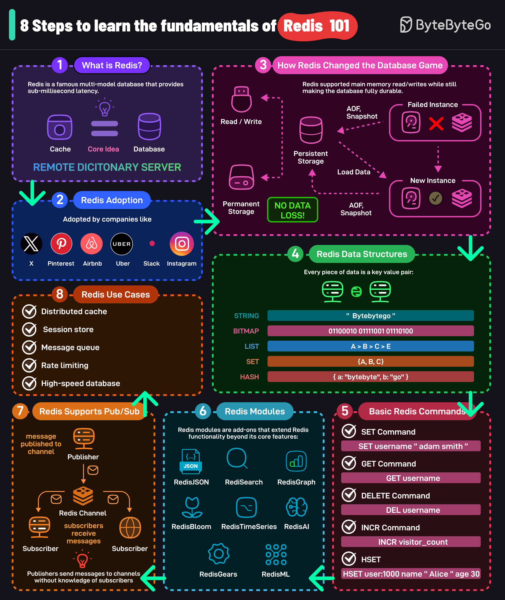
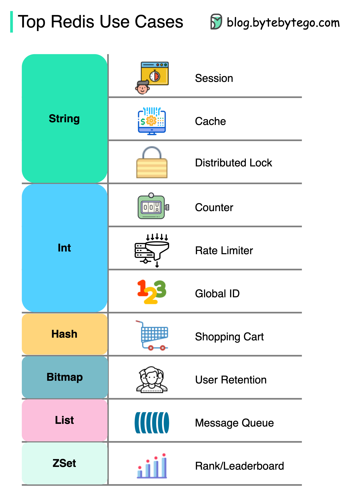
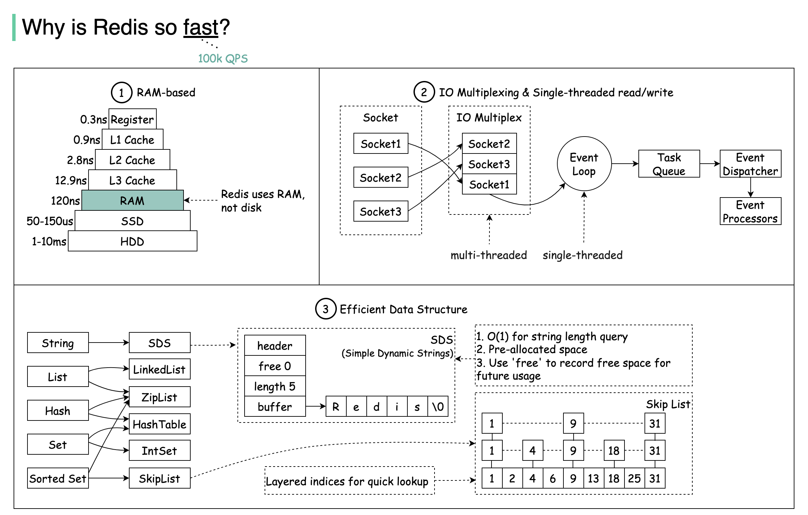

## What is Redis?

Redis (Remote Dictionary Server) is a multi-modal database that provides sub-millisecond latency. The core idea behind Redis is that a cache can also act as a full-fledged database.

### Redis Adoption

High-traffic internet websites like Airbnb, Uber, Slack, and many others have adopted Redis in their technology stack.

### How Redis Changed the Database Game?

Redis supports main memory read/writes while still supporting fully durable storage. Read and writes are served from the main memory but the data is also persisted to the disk. This is done using snapshots (RDB) and AOF.

### Redis Data Structures

Redis stores data in key-value format. It supports various data structures such as strings, bitmaps, lists, sets, sorted sets, hash, JSON, etc.

### Basic Redis Commands

Some of the most used Redis commands are SET, GET, DELETE, INCR, HSET, etc. There are many more commands available.

### Redis Modules

Redis modules are add-ons that extend Redis functionality beyond its core features. Some prominent modules are RediSearch, RedisJSON, RedisGraph, RedisBloom, RedisAI, RedisTimeSeries, RedisGears, RedisML, and so on.

### Redis Pub/Sub

Redis also supports even-driven architecture using a publish-subscribe communication model.

## Redis Use Cases

Top Redis use cases are Distributed Caching, Session Storage, Message Queue, Rate Limiting, High-Speed Database, etc.

There is more to Redis than just caching.

Redis can be used in a variety of scenarios as shown in the diagram.

### Session

We can use Redis to share user session data among different services.

### Cache

We can use Redis to cache objects or pages, especially for hotspot data.

### Distributed lock

We can use a Redis string to acquire locks among distributed services.

### Counter

We can count how many likes or how many reads for articles.

### Rate limiter

We can apply a rate limiter for certain user IPs.

### Global ID generator

We can use Redis Int for global ID.

### Shopping cart

We can use Redis Hash to represent key-value pairs in a shopping cart.

### Calculate user retention

We can use Bitmap to represent the user login daily and calculate user retention.

### Message queue

We can use List for a message queue.

Ranking

We can use ZSet to sort the articles.

### Why it is so fast?

Redis is a RAM-based database. RAM access is at least 1000 times faster than random disk access.

Redis leverages IO multiplexing and single-threaded execution loop for execution efficiency.

Redis leverages several efficient lower-level data structures.
