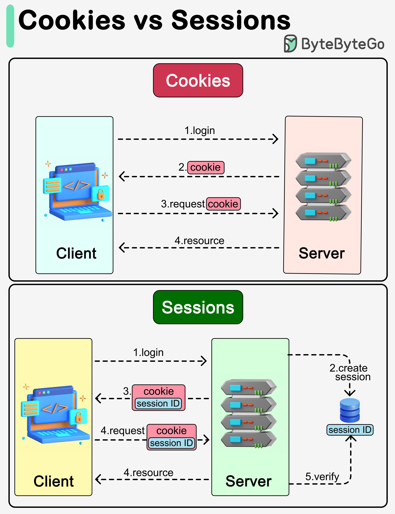
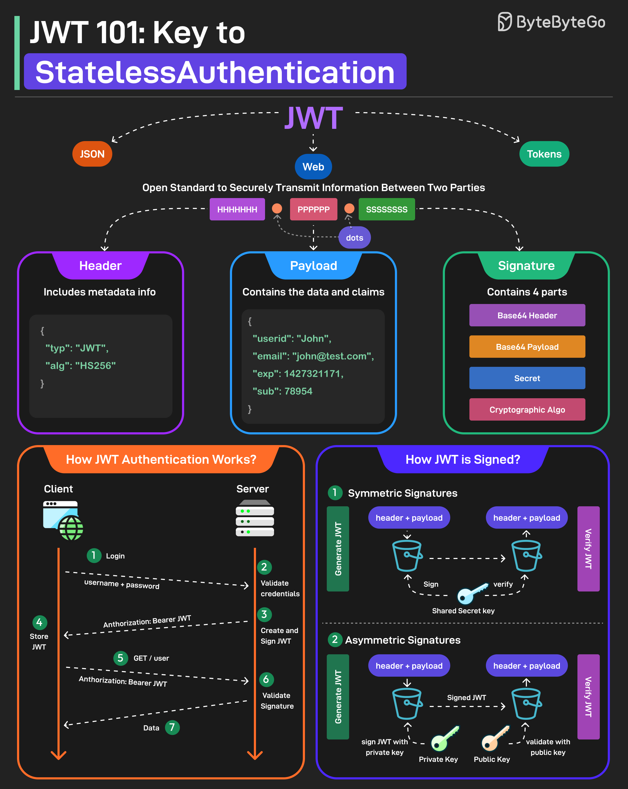
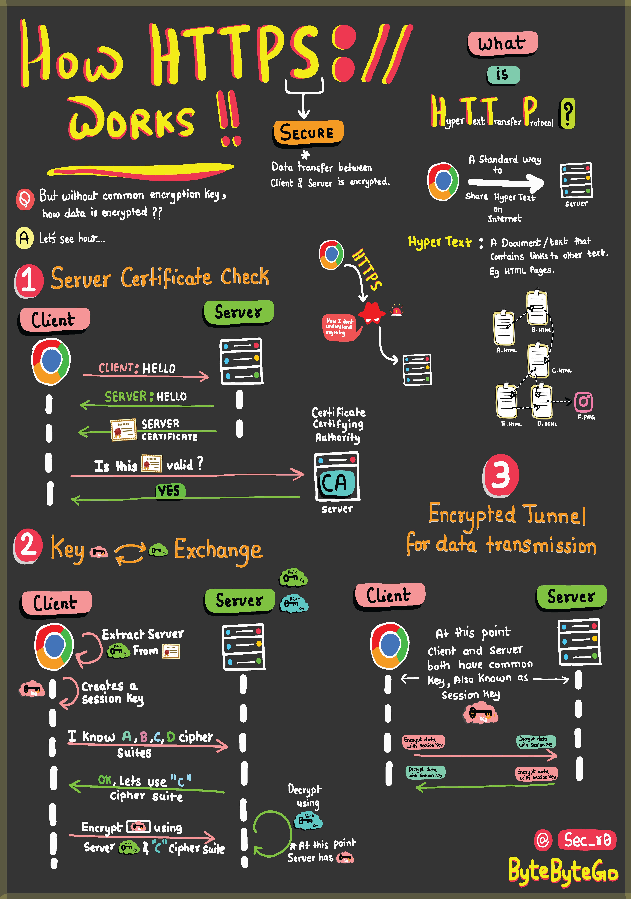

# 🚀 **API Security**

Security is one of the most important aspects of API design. Modern APIs face threats like unauthorized access, injection attacks, data leaks, replay attacks, and DDoS.
Below are the **12 fundamental strategies** to secure APIs.

## 1️⃣ **Use HTTPS**

### ✔ Concept

HTTPS secures API calls by performing a TLS handshake where the client verifies the server certificate, negotiates a session key, and then all request/response data is encrypted using symmetric encryption. This prevents interception, tampering, and man-in-the-middle attacks. It protects:

- Data confidentiality
- Data integrity
- Authentication of server

### ✔ Why it matters

Prevents:

- Man-in-the-middle attacks
- Sniffing
- Data tampering

“Never expose an API over HTTP; always enforce HTTPS using HSTS and TLS ≥ 1.2.”

---

## 2️⃣ **Use OAuth2**

### ✔ Concept

OAuth2 is an **authorization framework** used when a user grants permission for an app to access protected resources (Google Login, GitHub Login, etc.).
Delegates access using tokens instead of passwords
OAuth2 works by redirecting the user to an authorization server, obtaining an access token, and sending that token to the API instead of credentials. The API verifies the token’s signature and grants limited, scoped access without exposing the user’s password.

### Roles:

1. **Resource Owner** (user)
2. **Authorization Server** (Google/Facebook/Auth0)
3. **Resource Server** (your API)

### ✔ Why it matters

- Avoids storing passwords
- Easy revocation of access
- Token-based, scalable security

“OAuth2 with OpenID Connect is the industry standard for user authentication + authorization.”

---

## 3️⃣ **Use WebAuthn**

### ✔ Concept

Uses public/private keys instead of passwords

WebAuthn registers a public key on the server while storing the private key securely inside the user’s device/hardware key. During login, the server sends a challenge, the private key signs it, and the server verifies it with the stored public key — eliminating phishing and password theft entirely.
WebAuthn enables **passwordless authentication** using:

- Biometrics
- Hardware keys (YubiKey)
- Secure authenticators

### ✔ Why it matters

- Removes password vulnerabilities
- Prevents phishing
- Uses public/private key cryptography

“WebAuthn is part of FIDO2 and is becoming the most secure authentication method.”

---

## 4️⃣ **Use Leveled API Keys**

### ✔ Concept

Different API keys have **different permission levels** (read-only, write-only, admin).
Assign keys with different scopes/permissions

Each API key is tied to a specific permission level (read-only, write-only, admin). When a request comes in, the server checks the key’s level and only allows operations permitted by that role. If a lower-level key is leaked, only that limited access is exposed.

### ✔ Why it matters

- Minimizes blast radius
- If a key leaks, damage is limited
- Enables granular access control

“Leveled keys allow implementing least-privilege access across all API consumers.”

---

## 5️⃣ **Authorization**

### ✔ Concept

Authorization determines what resources a user **can access or modify**.
After authentication, the API checks the user’s role or attributes to decide whether they can access or modify the requested resource. This prevents unauthorized data access even if the user is authenticated.

### ✔ Why it matters

- Prevents privilege escalation
- Protects sensitive resources

### ✔ Good Practice

- RBAC → Role Based Access Control
- ABAC → Attribute Based Access Control
- Fine-grained permissions

“Authentication = who you are, Authorization = what you can do.”

---

## 6️⃣ **Rate Limiting**

### ✔ Concept

Controls how many requests a client can make within a given timeframe.
Controls request frequency to prevent abuse

The server tracks how many requests each user/IP makes using counters or token-bucket algorithms. If the rate exceeds the limit, further requests are rejected with 429 Too Many Requests. This protects APIs from brute force and DDoS attacks.

### ✔ Why it matters

Prevents:

- Abuse
- API overuse
- DoS/DDoS attacks

### ✔ Common Strategies

- IP-based rate limiting
- User-based rate limiting
- Token bucket
- Leaky bucket

“Rate limiting protects backend resources and ensures fair usage across clients.”

---

## 7️⃣ **API Versioning**

### ✔ Concept

Keeps older versions working while adding new ones

The API exposes endpoints like /v1/ and /v2/. Each version runs independently so that new functionality does not break older clients. This allows safe evolution of APIs without forcing clients to update immediately.
Exposing APIs with versions:
`/v1/users/123`
`/v2/users/123`

### ✔ Why it matters

- Backward compatibility
- Safe API evolution
- Reduced risk when changing schemas or behaviors

“Never delete or break existing endpoints; introduce new versions carefully.”

---

## 8️⃣ **Allowlisting (Whitelisting)**

### ✔ Concept

Restrict API access to only **trusted** clients, IPs, or domains.
Allows only approved IPs/users to access the API

Before processing a request, the API checks if the client’s IP, user, or token exists in an approved list. If not, the request is blocked. This restricts API access to trusted clients and greatly reduces attack surface

### ✔ Why it matters

- Reduces attack surface
- Blocks unknown or malicious traffic
- Useful for internal APIs

“Allowlists are extremely effective for B2B APIs or private microservices.”

---

## 9️⃣ **Check OWASP API Security Risks**

### ✔ Concept

Follow a standard list of API vulnerabilities

OWASP provides the API Top 10 (e.g., Broken Authentication, Excessive Data Exposure). Developers use these guidelines to scan, test, and design APIs so they avoid common vulnerabilities before deployment.
OWASP lists top API vulnerabilities:

- API1: Broken Object Level Authorization
- API2: Broken Authentication
- API3: Excessive Data Exposure
- API4: Rate Limiting issues
- API5: Broken Function Level Authorization
  … and more.

### ✔ Why it matters

API-specific attacks differ from web page attacks.

“I always review OWASP API Top 10 when designing any production-ready API.”

---

## 🔟 **Use API Gateway**

### ✔ Concept

A gateway sits between clients and backend services and handles:
Centralizes authentication, rate limiting, and routing

The API Gateway sits in front of your services and intercepts every request. It handles authentication, rate limiting, logging, request validation, routing, and threat detection — ensuring all microservices follow uniform security policies automatically.

- Authentication
- Logging
- Rate limiting
- Request/response transformation
- Threat detection
- Routing

Examples: Nginx, Kong, AWS API Gateway, Apigee, Traefik.

### ✔ Why it matters

- Centralized policy enforcement
- Reduced complexity for backend microservices

“API Gateway enforces uniform security before traffic reaches microservices.”

---

## 1️⃣1️⃣ **Error Handling**

### ✔ Concept

APIs should return **safe, helpful error messages** without leaking internal details.
Return clean messages without exposing internal details

The API returns helpful but safe error messages (Invalid email format) instead of internal stack traces or database errors. This prevents attackers from learning system internals while still guiding valid clients to correct mistakes.

### ✔ Best Practices

✔ Provide descriptive, user-friendly errors
✘ Do _not_ expose stack traces
✘ Do not reveal internal architecture
✔ Use correct HTTP status codes

### ✔ Why it matters

Prevents information leaks (attackers love error messages).

---

## 1️⃣2️⃣ **Input Validation**

### ✔ Concept

Blocks malicious data before reaching the backend

Every incoming request is checked for correct types, formats, allowed characters, and size limits using a schema validator. Invalid or dangerous input (SQL injection, XSS payloads) is rejected early before it reaches the application logic or database.

Validate incoming data:

- Type checking
- Length checking
- Regex validation
- Schema validation (e.g., JSON Schema)

### ✔ Why it matters

Prevents:

- SQL injection
- XSS
- Command injection
- Buffer overflows

“Validation must happen on both client AND server — never trust client data.”

---

# Cookies vs Sessions


Cookies and sessions are both used to carry user information over HTTP requests, including user login status, user permissions, etc.

## Cookies

Cookies typically have size limits (4KB). They carry small pieces of information and are stored on the users’ devices. Cookies are sent with each subsequent user request. Users can choose to ban cookies in their browsers.

## Sessions

Unlike cookies, sessions are created and stored on the server side. There is usually a unique session ID generated on the server, which is attached to a specific user session. This session ID is returned to the client side in a cookie. Sessions can hold larger amounts of data. Since the session data is not directly accessed by the client, the session offers more security.


Session, cookie, JWT, token, SSO, and OAuth 2.0 - what are they?!

These terms are all related to user identity management. When you log into a website, you declare who you are (identification). Your identity is verified (authentication), and you are granted the necessary permissions (authorization). Many solutions have been proposed in the past, and the list keeps growing.

From simple to complex, here is my understanding of user identity management:

## WWW-Authenticate

WWW-Authenticate is the most basic method. You are asked for the username and password by the browser. As a result of the inability to control the login life cycle, it is seldom used today.

## Session-Cookie

A finer control over the login life cycle is session-cookie. The server maintains session storage, and the browser keeps the ID of the session. A cookie usually only works with browsers and is not mobile app friendly.

## Token

To address the compatibility issue, the token can be used. The client sends the token to the server, and the server validates the token. The downside is that the token needs to be encrypted and decrypted, which may be time-consuming.

## JWT

JWT is a standard way of representing tokens. This information can be verified and trusted because it is digitally signed. Since JWT contains the signature, there is no need to save session information on the server side.

## SSO (Single Sign-On)

By using SSO (single sign-on), you can sign on only once and log in to multiple websites. It uses CAS (central authentication service) to maintain cross-site information

## OAuth 2.0

By using OAuth 2.0, you can authorize one website to access your information on another website

# JWT



## What is a JWT

JWT or JSON Web Tokens is an open standard for securely transmitting information between two parties. They are widely used for authentication and authorization as a JSON object, encoded as a compact, URL-safe string:
`base64url(header).base64url(payload).base64url(signature)`.

Used heavily for **stateless authentication** and claims propagation.

## JWT structure

A JWT has **three** dot-separated parts

1. **Header** (JSON) — metadata about the token:

   - Typical fields:

     ```json
     { "typ": "JWT", "alg": "HS256" }
     ```

   - `alg` = signing algorithm (HS256, RS256, ES256, none, etc.).
   - `typ` often `JWT`.
   - Optional `kid` (key id) to indicate which key to use.

2. **Payload (Claims)** — the data. Contains standard and custom claims:

   - Example shown in image:

     ```json
     {
       "userid": "John",
       "email": "john@test.com",
       "exp": 1427321171,
       "sub": 78954
     }
     ```

   - **Registered claims** (recommended names): `iss` (issuer), `sub` (subject), `aud` (audience), `exp` (expiration time), `nbf` (not before), `iat` (issued at), `jti` (JWT ID).
   - **Public claims**: user-defined but should be collision-free (use namespacing).
   - **Private claims**: agreed-upon app-specific claims (roles, scopes).

3. **Signature** — The signature is what makes the JWT secure. It is created by taking the encoded header, encoded payload, secret key, and the algorithm and signing it.

   - Compute signature over the ASCII bytes of `base64url(header) + "." + base64url(payload)`.
   - Using algorithm and secret/private key:

     - Symmetric (HMAC): e.g. HMAC-SHA256 (HS256) with shared secret.
     - Asymmetric: e.g. RS256 (RSA with SHA-256) — sign with private key; verify with public key.

   - Final token: `xxxxx.yyyyy.zzzzz` (dots separate).

**Important:** Use _base64url_ encoding (URL-safe), not raw base64.

---

## How JWT-based authentication typically works (sequence)

1. **Client logs in** — client sends credentials (username/password) to server over HTTPS.
2. **Server validates credentials** — server checks DB/identity provider.
3. **Server creates & signs JWT** — server builds payload with claims (subject, expiry, roles, etc.) and signs it (HS256/RS256).
4. **Client stores JWT** — client receives token and stores it (cookie, localStorage, memory — choose carefully).
5. **Client makes API call** — includes token in `Authorization: Bearer <JWT>` header or sends cookie.
6. **Server validates signature & claims** — verifies signature, checks `exp`, `aud`, `iss`, `nbf`, and optionally `jti`.
7. **Server responds with data** — or rejects if invalid/expired.

For async/background tasks, the server may issue token to worker systems or include `jti` for traceability.

---

## Signing approaches — Symmetric vs Asymmetric (as per image)

### 1. Symmetric Signatures (HS256 / HMAC)

It uses a single secret key for both signing the token and verifying it. The same key must be shared between the server that signs the JWT and the system that verifies it.

- Process:

  - Server: `signature = HMAC(secret, base64url(header) + "." + base64url(payload))`.
  - Server (or other verifying party with same secret): recomputes and compares signature.

- **Pros:** Simple, fast.
- **Cons:** Any verifier must hold the secret → key distribution risk. Not ideal when many services need to verify but you want only one signer.

### 2. Asymmetric Signatures (RS256 / ES256)

In this case, a private key is used to sign the token, and a public key to verify it. The private key is kept secure on the server, while the public key can be distributed to anyone who needs to verify the token.

- Process:

  - Issuer signs with private key. Verifiers fetch public key (via JWKS endpoint) and verify signature.

- **Pros:** Better for distributed systems and 3rd parties; private key is kept secret; public key can be widely shared safely.
- **Cons:** More CPU for signing/verification; key rotation complexity.

**Key points:** Always verify `alg` and avoid trusting token-provided `alg` blindly. Never accept `alg: none`.

---

## Claims & common fields — what to include and why

- `iss` (issuer) — who issued token (URL or identifier).
- `sub` (subject) — unique id for user (user id).
- `aud` (audience) — intended recipient(s), check this to prevent token replay to other services.
- `exp` (expiration) — epoch timestamp when token expires (mandatory for security).
- `nbf` (not before) — token valid only after this time.
- `iat` (issued at) — timestamp of issue.
- `jti` (JWT id) — unique id, useful for token revocation/blacklisting.
- **Scopes / roles** — `roles`, `scope`, or custom claims for authorization.

**Rule:** Keep sensitive data out of payload (payload is only base64url-encoded, not encrypted). Anyone with the token can decode it.

---

## Storage & transmission: cookies vs localStorage vs memory

**Options & trade-offs:**

1. **Authorization header `Bearer <token>` (recommended for single-page apps)**

   - Sent in `Authorization` header.
   - Protection: must avoid storing token in insecure storage (localStorage) if XSS is possible.
   - Good when using short-lived access tokens + secure refresh flow.

2. **HttpOnly Secure Cookies**

   - Cookie with `HttpOnly`, `Secure`, `SameSite=Strict/Lax` flags prevents JS access and reduces XSS risk.
   - **CSRF risk:** cookies are sent automatically — protect with SameSite or anti-CSRF tokens.
   - Best for web apps that want to avoid storing tokens in JS.

3. **localStorage / sessionStorage**

   - Accessible by JS → vulnerable to XSS token theft.
   - Simpler to implement for SPAs, but riskier.

4. **In-memory storage**

   - Stores token in JS variable; disappears on reload — reduces persistent exposure; safe if page reloads are okay.

**Best practice:** Use **short-lived access tokens** and **HttpOnly refresh tokens in secure cookies** OR store tokens in memory + refresh by safe mechanism. Avoid long-lived tokens in localStorage.

---

## Token lifecycle: access tokens vs refresh tokens

- **Access token**

  - Short lifetime (minutes to hours).
  - Used to access APIs (Bearer token).

- **Refresh token**

  - Longer lifetime (days to months).
  - Stored more securely (HttpOnly cookie).
  - Used to obtain new access tokens when they expire.
  - **Rotation:** rotate refresh token on each use to prevent reuse; maintain one active token per session.
  - **Revoke/Blacklist:** store `jti` or session id in DB to support revocation.

**Pattern:** access token short-lived + stateless; refresh token rotates and is stateful (stored server-side or in DB to enable revocation).

---

# Validation checklist

When server receives JWT, always validate:

1. **Signature** using proper key and algorithm.
2. **`exp`** — ensure current time < expiration (allow small clock skew, e.g., 30s).
3. **`nbf`** — not before checks.
4. **`iss`** — matches expected issuer.
5. **`aud`** — token intended for this service.
6. **`jti`** — optional: check for revocation in DB/blacklist.
7. **`alg` validation** — ensure permitted alg list, do NOT accept `none`.
8. **Token structure** — three parts exist, base64url decode success, JSON parse success.

---

# Key management & rotation

- **Symmetric secrets:** rotate regularly; maintain short lifetimes; avoid sharing freely.
- **Asymmetric keys:** rotate private key periodically; publish public keys via **JWKS** endpoint (JSON Web Key Set) and use `kid` header to choose correct key.
- **Key rotation strategy:** support multiple active keys (old + new) for a transition period; sign with new key; verify with old & new during transition.
- **Store keys** securely (KMS, Vault). Do not embed keys in code.

---

# Security pitfalls & mitigations (common interview topics)

1. **Token theft (XSS / theft from storage)**

   - Mitigate: store tokens in HttpOnly cookies or in memory; harden app against XSS (CSP, sanitization); short-lived tokens.

2. **CSRF (when using cookies)**

   - Mitigate: sameSite cookies, anti-CSRF tokens, double-submit cookie pattern, or use Authorization header.

3. **Accepting `alg: none` attack**

   - Mitigate: never trust token-provided `alg`; server should only accept a configured set of algorithms.

4. **Algorithm confusion (HS256 vs RS256 attack)**

   - Example: attacker changes `alg` to HS256 and uses public key as HMAC secret.
   - Mitigate: explicitly require/validate algorithm server-side and use separate keys/stores.

5. **Replay attacks**

   - Mitigate: short expiration, include `jti` and maintain blacklist, or require re-auth for critical actions.

6. **Sensitive data in payload**

   - JWT payload is readable by anyone with token; do NOT include passwords, PII unless encrypted (JWE).

7. **Long-lived tokens**

   - Mitigate: prefer short-lived access tokens + refresh tokens with rotation and revocation.

8. **Clock skew issues**

   - Mitigate: allow small skew (30–120s) and ensure NTP sync on servers.

9. **Token revocation**

   - Stateless tokens are hard to revoke: store `jti` in DB for blacklisting or keep a session store keyed by token id — i.e., make refresh tokens stateful.

10. **Insufficient signature verification (no kid handling)**

    - Use `kid` and JWKS for key selection and rotation.

## Minimal code examples

### Node.js with `jsonwebtoken` (HS256)

```js
const jwt = require("jsonwebtoken");
const secret = process.env.JWT_SECRET; // keep secure

// sign
const token = jwt.sign({ sub: "123", roles: ["user"] }, secret, {
  algorithm: "HS256",
  expiresIn: "15m",
});

// verify
try {
  const payload = jwt.verify(token, secret, {
    algorithms: ["HS256"],
    issuer: "https://auth.example.com",
    audience: "api://default",
  });
  // validated
} catch (err) {
  // invalid token
}
```

### Node.js with RS256 (private/public keys)

```js
// sign with private key
const token = jwt.sign({ sub: "123" }, privateKey, {
  algorithm: "RS256",
  keyid: "key1",
  expiresIn: "15m",
});

// verify with public key
const payload = jwt.verify(token, publicKey, {
  algorithms: ["RS256"],
  issuer: "https://auth.example.com",
});
```

### Python with PyJWT (RS256)

```py
import jwt, time
payload = {"sub":"123", "iat": int(time.time()), "exp": int(time.time()) + 900}
token = jwt.encode(payload, private_key, algorithm="RS256", headers={"kid":"key1"})
claims = jwt.decode(token, public_key, algorithms=["RS256"], issuer="https://auth.example.com")
```

---

## Performance & size considerations

- JWTs can be large if you put many claims → adds to each request header size. Keep them compact.
- Avoid embedding large arrays or heavy data; store user id and fetch required info from DB/cache.
- For very high QPS, symmetric verification (HMAC) is faster; asymmetric verification is slower but more flexible.

---

## Example interview Qs (short model answers)

1. **Q:** Why include `exp`?
   **A:** Limits token lifetime, reduces window for misuse if token leaked.

2. **Q:** How to revoke a JWT?
   **A:** Use short-lived access tokens + revocable refresh tokens stored server-side (DB/Redis). Optionally maintain blacklist of `jti` in Redis for immediate revocation.

3. **Q:** HS256 vs RS256 — which to use?
   **A:** RS256 for multi-service architectures and external verification (public key distribution). HS256 for simple internal systems where secret can be centrally protected.

4. **Q:** Should I store JWT in localStorage?
   **A:** Avoid if XSS is a risk. Use HttpOnly secure cookies + SameSite for web apps, or store in memory with refresh token flow.

5. **Q:** How to handle token rotation?
   **A:** Rotate keys using `kid` header and JWKS; support old key for transition. For refresh tokens, rotate token on usage and revoke old token.

6. **Q:** What checks happen during verification?
   **A:** Signature, `exp`, `nbf`, `iss`, `aud`, `jti` if used, and algorithm whitelist.

---

## Quick checklist to show you know in interviews

- JWT = header + payload + signature (base64url separated by dots).
- Validate: signature, `exp`, `aud`, `iss`, `alg`.
- Use short-lived access tokens + refresh tokens for logout & revocation.
- Prefer HttpOnly cookies for refresh tokens; Authorization header for access tokens if safe.
- Use asymmetric keys + JWKS for distributed verification and key rotation.
- Don’t store secrets in payload; never accept `alg: none`.
- Implement refresh token rotation, `jti` blacklist, and key rotation.
- Protect against XSS (token theft) and CSRF (cookie flows); use TLS always.

---


HTTPS: Safeguards your data from eavesdroppers and breaches. Understand how encryption and digital certificates create an impregnable shield.

SSL Handshake: Behind the Scenes — Witness the cryptographic protocols that establish a secure connection. Experience the intricate exchange of keys and negotiation.

Secure Data Transmission: Navigating the Tunnel — Journey through the encrypted tunnel forged by HTTPS. Learn how your information travels while shielded from cyber threats.

HTML’s Role: Peek into HTML’s role in structuring the web. Uncover how hyperlinks and content come together seamlessly. And why is it called HYPER TEXT.
